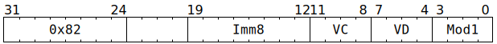

# `SFPSETEXP` (Vectorised set FP32 exponent bits)

**Summary:** Operating lanewise, combines the FP32 exponent bits from one place (either an immediate, or part of the destination register) with the FP32 sign and mantissa bits from somewhere else.

**Backend execution unit:** [Vector Unit (SFPU)](VectorUnit.md), simple sub-unit

## Syntax

```c
TT_SFPSETEXP(/* u8 */ Imm8, /* u4 */ VC, /* u4 */ VD, /* u4 */ Mod1)
```

## Encoding



## Functional model

```c
unsigned VB = VD;
if (VD < 8 || VD == 16) {
  lanewise {
    if (LaneEnabled) {
      uint32_t c = LReg[VC].u32; // FP32.
      uint32_t Sign = c >> 31;
      uint32_t Exp;
      uint32_t Man = c & 0x7fffff;
      if (Mod1 & SFPSETEXP_MOD1_ARG_IMM) {
        // New exponent bits come from Imm8.
        Exp = Imm8;
      } else {
        uint32_t b = LReg[VB].u32;
        if (Mod1 & SFPSETEXP_MOD1_ARG_EXPONENT) {
          // New exponent bits come from existing FP32 exponent bits.
          Exp = (b >> 23) & 0xff;
        } else {
          // New exponent bits come from low bits of existing integer.
          Exp = b & 0xff;
        }
      }
      LReg[VD].u32 = (Sign << 31) | (Exp << 23) | Man; // FP32.
    }
  }
}
```

Supporting definitions:
```c
#define SFPSETEXP_MOD1_ARG_IMM      1
#define SFPSETEXP_MOD1_ARG_EXPONENT 2
```
