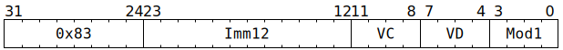

# `SFPSETMAN` (Vectorised set FP32 mantissa bits)

**Summary:** Operating lanewise, combines the FP32 mantissa bits from one place (either an immediate, or part of the destination register) with the FP32 sign and exponent bits from somewhere else.

**Backend execution unit:** [Vector Unit (SFPU)](VectorUnit.md), simple sub-unit

## Syntax

```c
TT_SFPSETMAN(/* u12 */ Imm12, /* u4 */ VC, /* u4 */ VD, /* u4 */ Mod1)
```

## Encoding



## Functional model

```c
unsigned VB = VD;
if (VD < 8 || VD == 16) {
  lanewise {
    if (LaneEnabled) {
      uint32_t c = LReg[VC].u32; // FP32.
      uint32_t Sign = c >> 31;
      uint32_t Exp = (c >> 23) & 0xff;
      uint32_t Man;
      if (Mod1 & SFPSETMAN_MOD1_ARG_IMM) {
        // New mantissa bits come from Imm12. They are shifted left by 11 places
        // because we want 23 bits for FP32, but the instruction only fits 12 bits.
        Man = Imm12 << 11;
      } else {
        // New mantissa bits come from existing FP32 mantissa bits or low bits of
        // existing integer.
        uint32_t b = LReg[VB].u32;
        Man = b & 0x7fffff;
      }
      LReg[VD].u32 = (Sign << 31) | (Exp << 23) | Man; // FP32.
    }
  }
}
```

Supporting definitions:
```c
#define SFPSETMAN_MOD1_ARG_IMM 1
```
