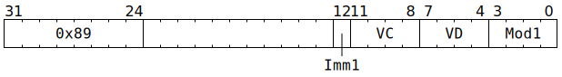

# `SFPSETSGN` (Vectorised set FP32 sign bit)

**Summary:** Operating lanewise, combines the FP32 sign bit from one place (either an immediate, or part of the destination register) with the FP32 exponent and mantissa bits from somewhere else. Can instead be operating on sign-magnitude integers, combining the sign bit from one place (either an immediate, or part of the destination register) with the magnitude bits from somewhere else. In either case, when the sign bit comes from an immediate, this is computing either the absolute value or the negated absolute value.

**Backend execution unit:** [Vector Unit (SFPU)](VectorUnit.md), simple sub-unit

## Syntax

```c
TT_SFPSETSGN(/* u1 */ Imm1, /* u4 */ VC, /* u4 */ VD, /* u4 */ Mod1)
```

## Encoding



## Functional model

```c
unsigned VB = VD;
if (VD < 8 || VD == 16) {
  lanewise {
    if (LaneEnabled) {
      uint32_t c = LReg[VC].u32; // FP32.
      uint32_t Sign;
      uint32_t Exp = (c >> 23) & 0xff;
      uint32_t Man = x & 0x7fffff;
      if (Mod1 & SFPSETSGN_MOD1_ARG_IMM) {
        // New sign bit comes from Imm1.
        Sign = Imm1;
      } else {
        // New sign bit comes from existing FP32 sign bit or integer sign bit.
        uint32_t b = LReg[VB].u32;
        Sign = b >> 31;
      }
      LReg[VD].u32 = (Sign << 31) | (Exp << 23) | Man; // FP32.
    }
  }
}
```

Supporting definitions:
```c
#define SFPSETSGN_MOD1_ARG_IMM 1
```
