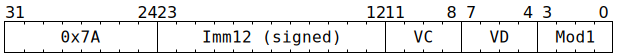

# `SFPSHFT` (Vectorised bitwise shift)

**Summary:** Performs lanewise bitwise (logical) shift left or right on a vector of 32-bit unsigned integers. There is no instruction for performing arithmetic right shift; software needs to construct this from a sequence of instructions if it requires it.

**Backend execution unit:** [Vector Unit (SFPU)](VectorUnit.md), simple sub-unit

## Syntax

```c
TT_SFPSHFT(/* i12 */ (Imm12 & 0xfff), /* u4 */ VC, /* u4 */ VD, /* u4 */ Mod1)
```

## Encoding



## Functional model

```c
unsigned VB = VD;
if (VD < 8 || VD == 16) {
  lanewise {
    if (LaneEnabled) {
      int32_t ShiftAmount = (Mod1 & SFPSHFT_MOD1_ARG_IMM) ? Imm12 : LReg[VC].i32;
      if (ShiftAmount >= 0) {
        LReg[VD].u32 = LReg[VB].u32 << (ShiftAmount & 31);
      } else {
        LReg[VD].u32 = LReg[VB].u32 >> ((-ShiftAmount) & 31);
      }
    }
  }
}
```

Supporting definitions:
```c
#define SFPSHFT_MOD1_ARG_IMM 1
```
