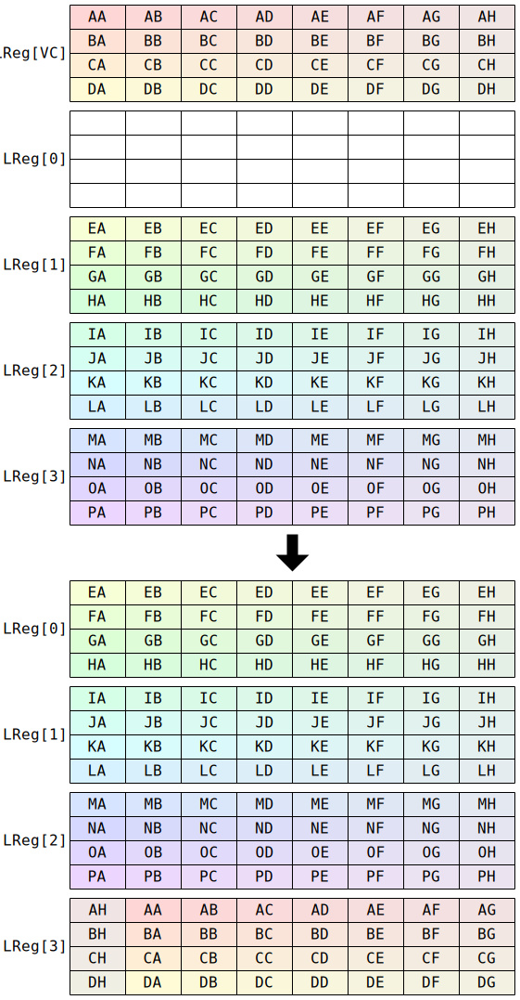

# `SFPSHFT2` (Vector shuffle or vector bitwise shift)

**Summary:** Performs some kind of bitwise shift within vector lanes, or some kind of shuffle of vector lanes. The exact behaviour is determined by the `Mod1` field; see the functional model for descriptions of each mode.

**Backend execution unit:** [Vector Unit (SFPU)](VectorUnit.md), round sub-unit

## Syntax

```c
TT_SFPSHFT2(/*  u4 */ VB,    /* u4 */ VC, /* u4 */ VD, /* u4 */ Mod1)
TT_SFPSHFT2(/* i12 */ (Imm12 & 0xfff), 0, /* u4 */ VD, /* u4 */ Mod1)
```

## Encoding


## Cross-lane data movement pattern

Some modes of this instruction involve cross-lane data movement. Assuming all 32 lanes active:

### `SFPSHFT2_MOD1_COPY4`

This mode does not actually involve any cross-lane data movement (merely lanewise movement between registers), but the diagram is included here for reference. 


### `SFPSHFT2_MOD1_SUBVEC_CHAINED_COPY4`


### `SFPSHFT2_MOD1_SUBVEC_SHFLROR1_AND_COPY4`



### `SFPSHFT2_MOD1_SUBVEC_SHFLROR1`


### `SFPSHFT2_MOD1_SUBVEC_SHFLSHR1`

See the functional model for details of the bug in this mode.


## Functional model

```c
switch (Mod1) {
case SFPSHFT2_MOD1_COPY4: // (Mod1 == 0)
  // Within each lane, shuffle L0 / L1 / L2 / L3.
  lanewise {
    if (VD < 12 || VD == 16 || LaneConfig.DISABLE_BACKDOOR_LOAD) {
      if (LaneEnabled) {
        LReg[0] = LReg[1];
        LReg[1] = LReg[2];
        LReg[2] = LReg[3];
        LReg[3] = 0;
      }
    }
  }
  break;
case SFPSHFT2_MOD1_SUBVEC_CHAINED_COPY4: {
  // Within each lane, shuffle L0 / L1 / L2 / L3, then shift the original L0 left
  // by eight lanes and assign it to L3.
  auto v0 = LReg[0];
  for (unsigned Lane = 0; Lane < 32; ++Lane) {
    if (VD < 12 || VD == 16 || LaneConfig[Lane].DISABLE_BACKDOOR_LOAD) {
      if (LaneEnabled[Lane]) {
        LReg[0][Lane] = LReg[1][Lane];
        LReg[1][Lane] = LReg[2][Lane];
        LReg[2][Lane] = LReg[3][Lane];
        LReg[3][Lane] = Lane < 24 ? v0[Lane + 8] : 0;
      }
    }
  }
  break; }
case SFPSHFT2_MOD1_SUBVEC_SHFLROR1_AND_COPY4:
  // Within each lane, shuffle L0 / L1 / L2 / L3, then within each group of eight
  // lanes of the original VC, rotate lanes right by one lane and assign to L3.
  if (VD < 12 || VD == 16 || LaneConfig.DISABLE_BACKDOOR_LOAD) {
    auto vc = LReg[VC];
    for (unsigned Lane = 0; Lane < 32; ++Lane) {
      if (LaneEnabled[Lane]) {
        LReg[0][Lane] = LReg[1][Lane];
        LReg[1][Lane] = LReg[2][Lane];
        LReg[2][Lane] = LReg[3][Lane];
        LReg[3][Lane] = Lane & 7 ? vc[Lane - 1] : vc[Lane + 7];
      }
    }
  }
  break;
case SFPSHFT2_MOD1_SUBVEC_SHFLROR1:
  // Within each group of eight lanes, rotate lanes right by one lane.
  if (VD < 12 || VD == 16 || LaneConfig.DISABLE_BACKDOOR_LOAD) {
    auto vc = LReg[VC];
    if (VD < 8 || VD == 16) {
      for (unsigned Lane = 0; Lane < 32; ++Lane) {
        if (LaneEnabled[Lane]) {
          LReg[VD][Lane] = Lane & 7 ? vc[Lane - 1] : vc[Lane + 7];
        }
      }
    }
  }
  break;
case SFPSHFT2_MOD1_SUBVEC_SHFLSHR1:
  // Within each group of eight lanes, shift lanes right by one lane.
  if (VD < 8 || VD == 16) {
    auto vc = LReg[VC];
    for (unsigned Lane = 0; Lane < 32; ++Lane) {
      if (LaneEnabled[Lane]) {
        LReg[VD][Lane] = Lane & 7 ? vc[Lane - 1] : HardwareBug();
      }
    }
  }
  break;
case SFPSHFT2_MOD1_SHFT_LREG:
  // Within each lane, shift bits left or right.
  if (VD < 8 || VD == 16) {
    lanewise {
      if (LaneEnabled) {
        int32_t vc = LReg[VC].i32;
        if (vc >= 0) {
          LReg[VD].u32 = LReg[VB].u32 << (vc & 31);
        } else {
          LReg[VD].u32 = LReg[VB].u32 >> ((-vc) & 31);
        }
      }
    }
  }
  break;
case SFPSHFT2_MOD1_SHFT_IMM:
  // This mode has limited use; see SFPSHFT for a more useful alternative.
  if (VD < 8 || VD == 16) {
    lanewise {
      if (LaneEnabled) {
        unsigned VB = Imm12 & 15;
        if (Imm12 >= 0) {
          LReg[VD].u32 = LReg[VB].u32 << (Imm12 & 31);
        } else {
          LReg[VD].u32 = LReg[VB].u32 >> ((-Imm12) & 31);
        }
      }
    }
  }
  break;
}
```

Note `HardwareBug()` in the above; it is meant to evaluate to `0`, but instead evaluates to `vc0[Lane + 7]`, where `vc0` is whatever the most recent `SFPSHFT2_MOD1_SUBVEC_SHFLROR1_AND_COPY4` or `SFPSHFT2_MOD1_SUBVEC_SHFLROR1` with `VD < 12` observed when executing its `auto vc = LReg[VC]`. Notably, executing `SFPSHFT2_MOD1_SUBVEC_SHFLROR1` with `VD` and `VC` both set to `9` will ensure that `vc0` is `0`.

Supporting definitions:
```c
#define SFPSHFT2_MOD1_COPY4 0
#define SFPSHFT2_MOD1_SUBVEC_CHAINED_COPY4 1
#define SFPSHFT2_MOD1_SUBVEC_SHFLROR1_AND_COPY4 2
#define SFPSHFT2_MOD1_SUBVEC_SHFLROR1 3
#define SFPSHFT2_MOD1_SUBVEC_SHFLSHR1 4
#define SFPSHFT2_MOD1_SHFT_LREG 5
#define SFPSHFT2_MOD1_SHFT_IMM 6
```

## Instruction scheduling

If `SFPSHFT2_MOD1_SUBVEC_SHFLROR1_AND_COPY4` is used, software must ensure that on the next cycle, the Vector Unit (SFPU) does not execute an instruction which reads from `LReg[0]` or `LReg[1]` or `LReg[2]` or `LReg[3]`. A NOP instruction can be inserted to ensure this (any kind of Tensix NOP suffices, though `SFPNOP` is conventional).

If `SFPSHFT2_MOD1_SUBVEC_SHFLROR1_AND_COPY4` is used, software must ensure that on the next cycle, the Vector Unit (SFPU) does not execute an instruction which writes to `LReg[1]` or `LReg[2]` or `LReg[3]`. A NOP instruction can be inserted to ensure this (any kind of Tensix NOP suffices, though `SFPNOP` is conventional).

If `SFPSHFT2_MOD1_SUBVEC_SHFLROR1` or `SFPSHFT2_MOD1_SUBVEC_SHFLSHR1` are used with `VD < 8`, software must ensure that on the next cycle, the Vector Unit (SFPU) does not execute an instruction which reads from `LReg[VD]`. A NOP instruction can be inserted to ensure this (any kind of Tensix NOP suffices, though `SFPNOP` is conventional).

If `SFPSHFT2_MOD1_SUBVEC_SHFLROR1_AND_COPY4` or `SFPSHFT2_MOD1_SUBVEC_SHFLROR1` or `SFPSHFT2_MOD1_SUBVEC_SHFLSHR1` are used, software must ensure that on the next cycle, the Vector Unit (SFPU) does not execute an instruction from the following list. A NOP instruction can be inserted to ensure this (any kind of Tensix NOP suffices, though `SFPNOP` is conventional).
* `SFPABS`
* `SFPAND`
* `SFPCAST`
* `SFPDIVP2`
* `SFPEXEXP`
* `SFPEXMAN`
* `SFPIADD`
* `SFPLZ`
* `SFPMOV`
* `SFPNOT`
* `SFPOR`
* `SFPSETEXP`
* `SFPSETMAN`
* `SFPSETSGN`
* `SFPSHFT`
* `SFPSHFT2` with `Mod1` being any of `SFPSHFT2_MOD1_COPY4`, `SFPSHFT2_MOD1_SUBVEC_CHAINED_COPY4`, `SFPSHFT2_MOD1_SHFT_LREG`, `SFPSHFT2_MOD1_SHFT_IMM`.
* `SFPSTOCHRND`
* `SFPXOR`

One simple way to comply with all of the above requirements is to always insert an `SFPNOP` instruction after any use of `SFPSHFT2_MOD1_SUBVEC_SHFLROR1_AND_COPY4` or `SFPSHFT2_MOD1_SUBVEC_SHFLROR1` or `SFPSHFT2_MOD1_SUBVEC_SHFLSHR1`.
