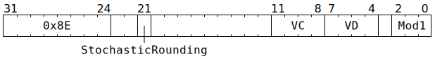

# `SFPSTOCHRND` (Vectorised reduce floating-point precision)

**Summary:** Operating lanewise, reduces mantissa precision of an FP32 value down from 23 bits to either 7 bits or 10 bits. The discarded mantissa bits are used for rounding, which can be either stochastic or round to nearest with ties away from zero. Various extreme floating-point values are also normalised away:
* Denormals become positive zero.
* Negative zero becomes positive zero.
* -NaN becomes negative infinity.
* +NaN becomes positive infinity.

This flavour of `SFPSTOCHRND` is intended to be used prior to an [`SFPSTORE`](SFPSTORE.md) instruction:
* `SFPSTORE` with `MOD0_FMT_BF16`: If the mantissa precision is reduced to 7 bits, a store with `MOD0_FMT_BF16` will be exact.
* `SFPSTORE` with `MOD0_FMT_FP16`: If the mantissa precision is reduced to either 7 or 10 bits, a store with `MOD0_FMT_FP16` will suffer no loss of mantissa precision (though there will be loss of exponent range, with out of range values clamped to positive or negative infinity).
* `SFPSTORE` with `MOD0_FMT_FP32`: If the mantissa precision is reduced to either 7 or 10 bits, a store with `MOD0_FMT_FP32` will be exact, and any subsequent conversion to TF32 will also be exact.

Due to a hardware bug, stochastic rounding has a slight bias towards increasing the magnitude rather than being 50:50, and can even sometimes increase the magnitude of values which do not require rounding.

**Backend execution unit:** [Vector Unit (SFPU)](VectorUnit.md), round sub-unit

## Syntax

```c
TT_SFP_STOCH_RND(/* bool */ StochasticRounding,
                 0, 0,
                 /* u4 */ VC, /* u4 */ VD, /* u3 */ Mod1)
```

## Encoding



## Functional model

```c
if (Mod1 != SFPSTOCHRND_MOD1_FP32_TO_FP16A
 && Mod1 != SFPSTOCHRND_MOD1_FP32_TO_FP16B) {
  // Is some other flavour of SFPSTOCHRND; see other pages for details.
  UndefinedBehaviour();
}

lanewise {
  if (VD < 12 || VD == 16 || LaneConfig.DISABLE_BACKDOOR_LOAD) {
    if (LaneEnabled) {
      uint32_t PRNGBits = StochasticRounding ? AdvancePRNG() & 0x7fffff : 0x400000;
      uint32_t x = LReg[VC].u32; // FP32.
      uint32_t Exp = (c >> 23) & 0xff;
      if (Exp == 0) {
        // Denormal or zero? Becomes zero.
        x = 0;
      } else if (Exp == 255) {
        // +Infinity or +NaN? Becomes +Infinity.
        // -Infinity or -NaN? Becomes -Infinity.
        x &= 0xff800000u;
      } else if (Mod1 == SFPSTOCHRND_MOD1_FP32_TO_FP16A) {
        // Keep 10 bits of mantissa precision, discard 13 bits (use them for rounding).
        uint32_t DiscardedBits = x & 0x1fff;
        x -= DiscardedBits;
        if ((DiscardedBits << 10) >= PRNGBits) x += 0x2000;
      } else /* Mod1 == SFPSTOCHRND_MOD1_FP32_TO_FP16B */ {
        // Keep 7 bits of mantissa precision, discard 16 bits (use them for rounding).
        uint32_t DiscardedBits = c & 0xffff;
        x -= DiscardedBits;
        if ((DiscardedBits << 7) >= PRNGBits) x += 0x10000;
      }
      if (VD < 8 || VD == 16) {
        LReg[VD].u32 = x; // FP32.
      }
    }
  }
}
```

Supporting definitions:
```c
#define SFPSTOCHRND_MOD1_FP32_TO_FP16A  0
#define SFPSTOCHRND_MOD1_FP32_TO_FP16B  1
```
