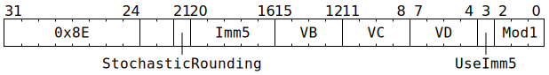

# `SFPSTOCHRND` (Vectorised reduce range of sign-magnitude integer)

**Summary:** Operating lanewise, starts with a 32-bit sign-magnitude integer, shifts the magnitude right by some number of bits (the discarded bits are used for rounding, which can be either stochastic or round to nearest with ties away from zero), then either clamps to the range -127 through +127 or takes the absolute value and then clamps to the range 0 through 255. The result remains a 32-bit sign-magnitude integer, though if the absolute value was taken, the result can be interpreted as any kind of integer.

This flavour of `SFPSTOCHRND` is intended to be used prior to an [`SFPSTORE`](SFPSTORE.md) instruction with `MOD0_FMT_INT8`.

Due to a hardware bug, stochastic rounding has a slight bias towards increasing the magnitude rather than being 50:50, and can even sometimes increase the magnitude of values which do not require rounding.

**Backend execution unit:** [Vector Unit (SFPU)](VectorUnit.md), round sub-unit

## Syntax

```c
TT_SFP_STOCH_RND(/* bool */ StochasticRounding,
                 /* u5 */ Imm5,
                 /* u4 */ VB,
                 /* u4 */ VC,
                 /* u4 */ VD,
               ((/* bool */ UseImm5) << 3) +
                 /* u3 */ Mod1)
```

## Encoding



## Functional model

```c
if (Mod1 != SFPSTOCHRND_MOD1_INT32_TO_UINT8
 && Mod1 != SFPSTOCHRND_MOD1_INT32_TO_INT8) {
  // Is some other flavour of SFPSTOCHRND; see other pages for details.
  UndefinedBehaviour();
}

lanewise {
  if (VD < 12 || LaneConfig.DISABLE_BACKDOOR_LOAD) {
    if (LaneEnabled) {
      uint32_t PRNGBits = StochasticRounding ? AdvancePRNG() & 0x7fffff : 0x400000;
      uint32_t c = LReg[VC].u32; // Sign-magnitude integer.
      uint32_t Sign = c & 0x80000000u;
      uint64_t Mag  = c & 0x7fffffffu;
      Mag <<= 23;
      Mag >>= UseImm5 ? Imm5 : (LReg[VB].u32 & 31);
      Mag = (Mag >> 23) + ((Mag & 0x7fffff) >= PRNGBits);
      if (Mod1 == SFPSTOCHRND_MOD1_INT32_TO_UINT8) {
        if (Mag > 255) Mag = 255;
        Sign = 0;
      } else /* Mod1 == SFPSTOCHRND_MOD1_INT32_TO_INT8 */ {
        if (Mag > 127) Mag = 127;
        if (Mag == 0) Sign = 0;
      }
      if (VD < 8 || VD == 16) {
        LReg[VD].u32 = Sign + Mag; // Sign-magnitude integer.
      }
    }
  }
}
```

Supporting definitions:
```c
#define SFPSTOCHRND_MOD1_INT32_TO_UINT8 4
#define SFPSTOCHRND_MOD1_INT32_TO_INT8  5
```
