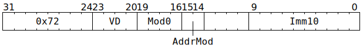
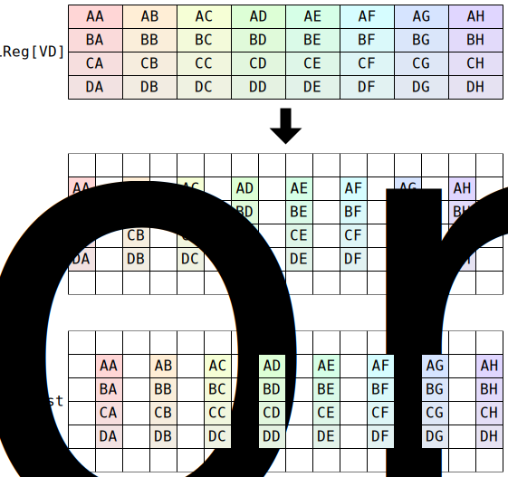

# `SFPSTORE` (Move from `LReg` to `Dst`)

**Summary:** Move (up to) 32 datums from an `LReg` to the even or odd columns of four consecutive rows of [`Dst`](Dst.md). To bridge the gap between [`LReg` data types](LReg.md#data-types) and [`Dst` data types](Dst.md#data-types), some data type conversions are supported as part of the instruction, though software might still want a preceding [`SFPSTOCHRND`](SFPSTOCHRND.md) or [`SFPCAST`](SFPCAST.md) instruction to achieve a richer set of conversions.

**Backend execution unit:** [Vector Unit (SFPU)](VectorUnit.md)

## Syntax

```c
TT_SFPSTORE(/* u4 */ VD, /* u4 */ Mod0, /* u2 */ AddrMod, /* u10 */ Imm10)
```

## Encoding



## Data type conversions

One of the following data type conversions is specified using the `Mod0` field:

|`SFPSTORE` Mode|Expected [`LReg` data type](LReg.md#data-type)|→|Resultant [`Dst` data type](Dst.md#data-types)|
|---|---|---|---|
|`MOD0_FMT_FP16`|FP32 (not containing NaN)|→|FP16 (†)|
|`MOD0_FMT_BF16`|FP32 (not containing NaN)|→|BF16 (†)|
|`MOD0_FMT_FP32`|FP32 or sign-magnitude integer|→|FP32 or Integer "32" (as per `LReg` type)|
|`MOD0_FMT_INT32`|FP32 or sign-magnitude integer|→|FP32 or Integer "32" (as per `LReg` type)|
|`MOD0_FMT_INT32_ALL` (‡)|FP32 or sign-magnitude integer|→|FP32 or Integer "32" (as per `LReg` type)|
|`MOD0_FMT_INT32_SM`|Two's complement integer (not containing -2<sup>31</sup>)|→|Integer "32"|
|`MOD0_FMT_INT8`|Sign-magnitude integer in range ±1023|→|Integer "8"|
|`MOD0_FMT_INT8_COMP`|Two's complement integer in range ±1023|→|Integer "8"|
|`MOD0_FMT_LO16_ONLY`|Unsigned integer (low 16 bits thereof)|→|Integer "16" containing opaque 16 bits|
|`MOD0_FMT_HI16_ONLY`|Unsigned integer (high 16 bits thereof)|→|Integer "16" containing opaque 16 bits|
|`MOD0_FMT_INT16`|Sign-magnitude integer in range ±32767|→|Integer "16"|
|`MOD0_FMT_UINT16`|Unsigned integer (low 16 bits thereof)|→|Integer "16" containing opaque 16 bits|
|`MOD0_FMT_LO16`|Unsigned integer (rotated left by 16 bits)|→|Opaque 32 bits|
|`MOD0_FMT_HI16`|Unsigned integer|→|Opaque 32 bits|

(†) As part of the conversion to FP16 / BF16, denormals will be flushed to zero, and mantissa will be truncated towards zero. If converting to FP16, then large magnitudes are converted to infinity. If converting to FP16, NaN is also converted to infinity, so software is advised to avoid NaN inputs for this conversion. If converting to BF16, the mantissa truncation can turn _some_ NaN values into infinity, so software is again advised to avoid NaN inputs for this conversion.

(‡) This mode also changes the addressing scheme slightly, and causes `LaneEnabled` to be ignored; see the functional model for details.

The `MOD0_FMT_SRCB` mode resolves to one of `MOD0_FMT_FP16` or `MOD0_FMT_BF16` or `MOD0_FMT_FP32`; see the functional model for details.

## Cross-lane data movement pattern

Assuming all 32 lanes active:



Note that this pattern is the exact inverse of [`SFPLOAD`](SFPLOAD.md).

## Functional model

```c
uint1_t StateID = ThreadConfig[CurrentThread].CFG_STATE_ID_StateID;
auto& ConfigState = Config[StateID];

// Resolve MOD0_FMT_SRCB to something concrete.
if (Mod0 == MOD0_FMT_SRCB) {
  if (ConfigState.ALU_ACC_CTRL_SFPU_Fp32_enabled) {
    Mod0 = MOD0_FMT_FP32; // NB: Functionally identical to MOD0_FMT_INT32.
  } else {
    uint4_t SrcBFmt = ConfigState.ALU_FORMAT_SPEC_REG_SrcB_override ? ConfigState.ALU_FORMAT_SPEC_REG_SrcB_val : ConfigState.ALU_FORMAT_SPEC_REG1_SrcB;
    if (SrcBFmt in {FP32, TF32, BF16, BFP8, BFP4, BFP2, INT32, INT16}) {
      Mod0 = MOD0_FMT_BF16;
    } else {
      Mod0 = MOD0_FMT_FP16;
    }
  }
}

// Apply various Dst address adjustments.
// The top 8 bits of Addr end up selecting an aligned group of four rows of Dst, the
// next bit selects between even and odd columns, and the low bit goes unused.
uint10_t Addr = Imm10 + ThreadConfig[CurrentThread].DEST_TARGET_REG_CFG_MATH_Offset;
if (Mod0 == MOD0_FMT_INT32_ALL) {
  Addr += (RWCs[CurrentThread].Dst + ConfigState.DEST_REGW_BASE_Base) & 3;
} else {
  Addr += RWCs[CurrentThread].Dst + ConfigState.DEST_REGW_BASE_Base;
}

for (unsigned Lane = 0; Lane < 32; ++Lane) {
  if (LaneConfig[Lane].BLOCK_DEST_WR_FROM_SFPU) continue;
  if (VD < 12 || LaneConfig[Lane].DISABLE_BACKDOOR_LOAD) {
    if (LaneEnabled[Lane] || Mod0 == MOD0_FMT_INT32_ALL) {
      uint32_t Datum = LReg[VD][Lane].u32;
      uint10_t Row = (Addr & ~3) + (Lane / 8);
      uint4_t Column = (Lane & 7) * 2;
      if ((Addr & 2) || LaneConfig[Lane & 7].DEST_WR_COL_EXCHANGE) {
        Column += 1;
      }
      switch (Mod0) {
      case MOD0_FMT_FP16:      Dst16b[Row][Column] = FP16Shuffle(ToFP16(Datum)); break;
      case MOD0_FMT_BF16:      Dst16b[Row][Column] = BF16Shuffle(ToBF16(Datum)); break;
      case MOD0_FMT_FP32:      Dst32b[Row][Column] = FP32Shuffle(Datum); break;
      case MOD0_FMT_INT32:     Dst32b[Row][Column] = FP32Shuffle(Datum); break;
      case MOD0_FMT_INT32_ALL: Dst32b[Row][Column] = FP32Shuffle(Datum); break;
      case MOD0_FMT_INT32_SM:  Dst32b[Row][Column] = FP32Shuffle(ToSignMag(Datum)); break;
      case MOD0_FMT_INT8:      Dst16b[Row][Column] = FP16Shuffle(SignMag11ToFP16(Datum)); break;
      case MOD0_FMT_INT8_COMP: Dst16b[Row][Column] = FP16Shuffle(SignMag11ToFP16(ToSignMag(Datum))); break;
      case MOD0_FMT_LO16_ONLY: Dst16b[Row][Column] = Datum & 0xffff; break;
      case MOD0_FMT_HI16_ONLY: Dst16b[Row][Column] = Datum >> 16; break;
      case MOD0_FMT_INT16:     Dst16b[Row][Column] = ((Datum >> 31) << 15) | (Datum & 0x7fff); break;
      case MOD0_FMT_UINT16:    Dst16b[Row][Column] = Datum & 0xffff; break;
      case MOD0_FMT_LO16:      Dst32b[Row][Column] = (Datum << 16) | (Datum >> 16); break;
      case MOD0_FMT_HI16:      Dst32b[Row][Column] = Datum; break;
      case MOD0_FMT_ZERO:      Dst16b[Row][Column] = 0; break;
      // NB: MOD0_FMT_SRCB already resolved to either MOD0_FMT_FP32 or MOD0_FMT_BF16 or MOD0_FMT_FP16.
      }
    }
  }
}

// Advance Dst / SrcA / SrcB RWCs (but _not_ Fidelity RWC).
ApplyPartialAddrMod(AddrMod);
```

Supporting definitions:
```c
#define MOD0_FMT_SRCB      0
#define MOD0_FMT_FP16      1
#define MOD0_FMT_BF16      2
#define MOD0_FMT_FP32      3
#define MOD0_FMT_INT32     4
#define MOD0_FMT_INT8      5
#define MOD0_FMT_UINT16    6
#define MOD0_FMT_HI16      7
#define MOD0_FMT_INT16     8
#define MOD0_FMT_LO16      9
#define MOD0_FMT_INT32_ALL 10
#define MOD0_FMT_ZERO      11
#define MOD0_FMT_INT32_SM  12
#define MOD0_FMT_INT8_COMP 13
#define MOD0_FMT_LO16_ONLY 14
#define MOD0_FMT_HI16_ONLY 15

uint16_t ToFP16(uint32_t x) {
  uint32_t Sign = x >> 31;
  int32_t Exp = (int32_t)((x >> 23) & 0xff) - 112;
  uint32_t Man = x & 0x7fffff;
  if (Exp <= 0) { // Flush underflow and denormals to signed zero.
    Exp = 0;
    Man = 0;
  } else if (Exp > 31) { // Saturate on overflow.
    // Note that Dst doesn't support NaNs or infinities; the value emitted
    // here will instead be interpreted as a huge finite value (which behaves
    // similarly to infinity in many - but not all - operations).
    Exp = 31;
    Man = 0x7fffff;
  }
  Man >>= 13; // Truncate toward zero.
  return (Sign << 15) | ((uint32_t)Exp << 10) | Man;
}

uint16_t ToBF16(uint32_t x) {
  // Flush denormals to signed zero, then truncate toward zero.
  uint32_t Sign = x & 0x80000000;
  uint32_t Exp  = x & 0x7f800000;
  uint32_t Man  = x & 0x007fffff;
  if (Exp == 0) {
    Man = 0;
  }
  return (Sign | Exp | Man) >> 16;
}

uint32_t ToSignMag(uint32_t x) {
  // Convert from 32-bit two's complement to sign and 31-bit magnitude.
  uint32_t Sign = x & 0x80000000;
  uint32_t Mag = Sign ? -x : x;
  return Sign | (Mag & 0x7fffffff);
}

uint32_t FP32Shuffle(uint32_t x) {
  // Rearrange fields from Sign,Exp,Man to Sign,ManHi,Exp,ManLo as
  // Dst holds FP32 data in this rearranged form. This is equivalent
  // to applying BF16Shuffle to the high 16 bits.
  uint16_t Hi = x >> 16;
  uint16_t Lo = x & 0xffff;
  Hi = BF16Shuffle(Hi);
  return (uint32_t(Hi) << 16) | Lo;
}

uint16_t BF16Shuffle(uint16_t x) {
  // Rearrange fields from Sign,Exp,Man to Sign,Man,Exp as Dst holds
  // BF16 data in this rearranged form.
  uint16_t Sign = x & 0x8000;
  uint16_t Exp  = x & 0x7f80;
  uint16_t Man  = x & 0x007f;
  return Sign | (Man << 8) | (Exp >> 7);
}

uint16_t FP16Shuffle(uint16_t x) {
  // Rearrange fields from Sign,Exp,Man to Sign,Man,Exp as Dst holds
  // FP16 data in this rearranged form.
  uint16_t Sign = x & 0x8000;
  uint16_t Exp  = x & 0x7c00;
  uint16_t Man  = x & 0x03ff;
  return Sign | (Man << 5) | (Exp >> 10);
}

uint16_t SignMag11ToFP16(uint32_t x) {
  // This converts to the type which Dst / SrcA / SrcB call "integer 8".
  // A preceding SFPSTOCHRND instruction can be used to generate input
  // data in the range -127 through +127 or 0 through 255.
  uint16_t Sign = (x >> 31) << 15;
  uint16_t Exp = 16 << 10; // NB: Fixed exponent.
  uint16_t Man = x & 0x3ff;
  return Sign | Exp | Man;
}
```
