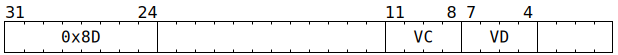

# `SFPXOR` (Vectorised bitwise exclusive-or)

**Summary:** Performs lanewise bitwise exclusive-or between two vectors of 32-bit unsigned integers.

**Backend execution unit:** [Vector Unit (SFPU)](VectorUnit.md), simple sub-unit

## Syntax

```c
TT_SFPXOR(0, /* u4 */ VC, /* u4 */ VD, 0)
```

## Encoding



## Functional model

```c
unsigned VB = VD;
if (VD < 8 || VD == 16) {
  lanewise {
    if (LaneEnabled) {
      LReg[VD].u32 = LReg[VB].u32 ^ LReg[VC].u32;
    }
  }
}
```
