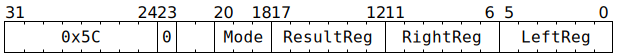
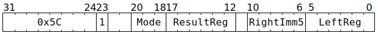

# `SHIFTDMAREG` (Perform bitwise shift on GPRs)

**Summary:** Performs an unsigned bitwise shift (left or right) of one Tensix GPR by another, or of one Tensix GPR by a 5-bit immediate.

**Backend execution unit:** [Scalar Unit (ThCon)](ScalarUnit.md)

## Syntax

```c
TT_SHIFTDMAREG(0, /* u3 */ Mode, /* u6 */ ResultReg, /* u6 */ RightReg , /* u6 */ LeftReg)
TT_SHIFTDMAREG(1, /* u3 */ Mode, /* u6 */ ResultReg, /* u5 */ RightImm5, /* u6 */ LeftReg)
```

## Encoding




## Functional model

```c
uint32_t LeftVal = GPRs[CurrentThread][LeftReg];
uint32_t RightVal = GPRs[CurrentThread][RightReg] & 0x1f; // RightReg  variant
uint32_t RightVal = RightImm5;                            // RightImm5 variant
uint32_t ResultVal;
switch (Mode) {
case SHIFTDMAREG_MODE_LEFT:  ResultVal = LeftVal << RightVal; break;
case SHIFTDMAREG_MODE_RIGHT: ResultVal = LeftVal >> RightVal; break;
default: UndefinedBehaviour(); break;
}
GPRs[CurrentThread][ResultReg] = ResultVal;
```

Supporting definitions:
```c
#define SHIFTDMAREG_MODE_LEFT  0
#define SHIFTDMAREG_MODE_RIGHT 1
```

## Performance

The `RightImm5` variant takes three cycles. The `RightReg` variant takes three cycles if `LeftReg` and `RightReg` come from the same aligned group of four GPRs, or four cycles otherwise.
