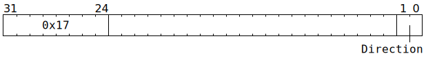
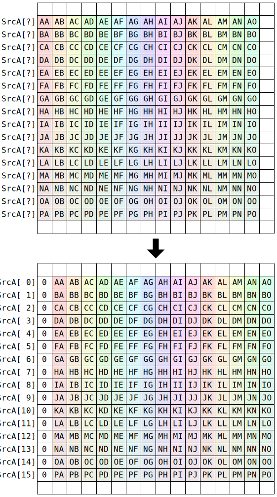
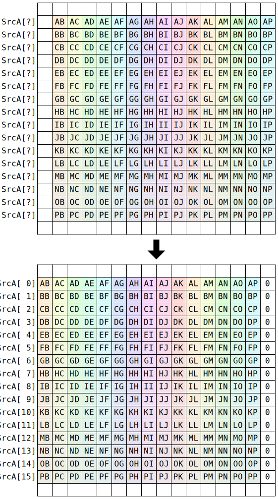

# `SHIFTXA` (Shift 16 rows of `SrcA` left or right by one lane)

**Summary:** An aligned block of 16 rows of `SrcA` is shifted left or right by one lane, with the vacant lane filled with zero, and written to the first 16 rows of `SrcA`. A hardware bug makes this instruction somewhat difficult to use.

**Backend execution unit:** [Matrix Unit (FPU)](MatrixUnit.md)

## Syntax

```c
TT_SHIFTXA(0, /* u2 */ Direction)
```

## Encoding



## Cross-lane data movement pattern

When `Direction==DIRECTION_RIGHT`:



When `Direction==DIRECTION_LEFT`:



## Functional model

This instruction will, if necessary, spend time waiting at the Wait Gate before being dispatched to the Matrix Unit (FPU):

```c
while (SrcA[MatrixUnit.SrcABank].AllowedClient != MatrixUnit) {
  wait;
}
```

Once dispatched to the Matrix Unit (FPU):
```c
uint6_t InRow = HardwareBug() & 0x30;

for (unsigned i = 0; i < 16; ++i) {
  switch (Direction) {
  case DIRECTION_RIGHT:
    for (unsigned Column = 15; Column > 0; --Column) {
      SrcA[MatrixUnit.SrcABank][i][Column] = SrcA[MatrixUnit.SrcABank][InRow + i][Column - 1];
    }
    SrcA[MatrixUnit.SrcABank][i][0] = 0;
    break;
  case DIRECTION_LEFT:
    for (unsigned Column = 0; Column < 15; ++Column) {
      SrcA[MatrixUnit.SrcABank][i][Column] = SrcA[MatrixUnit.SrcABank][InRow + i][Column + 1];
    }
    SrcA[MatrixUnit.SrcABank][i][15] = 0;
    break;
  }
}
```

Due to a hardware bug, `SHIFTXA` cannot specify which aligned block of 16 rows to use as input. The call to `HardwareBug()` in the above description evaluates to whatever the most recent `MFCONV3S1`, `CONV3S1`, `MPOOL3S1`, `APOOL3S1`, `CONV3S2`, `MPOOL3S2`, `APOOL3S2`, `MVMUL`, `ELWSUB`, `ELWADD`, `ELWMUL`, `DOTPV`, `GMPOOL`, `GAPOOL`, `MOVA2D`, `MOVB2D`, `MOVD2A`, `MOVD2B`, or `MOVB2A` instruction computed as its (starting) `SrcA` row address.

Supporting definitions:
```c
#define DIRECTION_RIGHT 2
#define DIRECTION_LEFT  3
```
