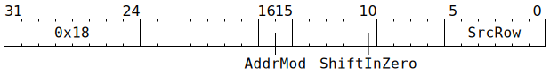
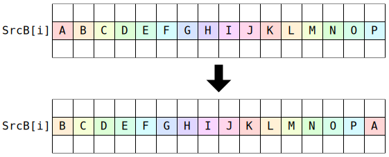
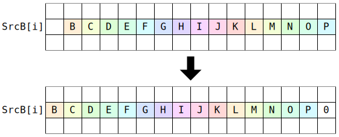

# `SHIFTXB` (Shift or rotate one row of `SrcB` left by one lane)

**Summary:** One row of `SrcB` is either rotated left by one lane, or shifted left by one lane and the rightmost lane set to zero.

**Backend execution unit:** [Matrix Unit (FPU)](MatrixUnit.md)

## Syntax

```c
TT_SHIFTXB(/* u2 */ AddrMod,
           /* bool */ ShiftInZero,
           /* u6 */ SrcRow)
```

## Encoding



## Cross-lane data movement pattern

When `ShiftInZero==false`:



When `ShiftInZero==true`:



## Functional model

This instruction will, if necessary, spend time waiting at the Wait Gate before being dispatched to the Matrix Unit (FPU):

```c
while (SrcB[MatrixUnit.SrcBBank].AllowedClient != MatrixUnit) {
  wait;
}
```

Once dispatched to the Matrix Unit (FPU):
```c
SrcRow = (SrcRow + RWCs[CurrentThread].SrcB) & 0x3f;

uint19_t Column0 = SrcB[MatrixUnit.SrcBBank][SrcRow][0];
for (unsigned Column = 0; Column < 14; ++Column) {
  SrcB[MatrixUnit.SrcBBank][SrcRow][Column] = SrcB[MatrixUnit.SrcBBank][SrcRow][Column + 1];
}
SrcB[MatrixUnit.SrcBBank][SrcRow][15] = ShiftInZero ? 0 : Column0;

ApplyAddrMod(AddrMod);
```

## Instruction scheduling

If `SHIFTXB` is used, then on the next cycle, the Matrix Unit (FPU) is not able to accept any instruction. If a thread presents any Matrix Unit (FPU) instruction, then hardware will automatically stall the thread for one cycle.
