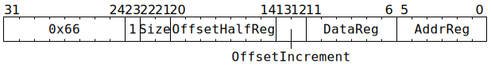

# `STOREIND` (L1 write from GPR)

**Summary:** Write between 8 and 128 bits from Tensix GPR(s) to L1. The instruction completes execution as soon as the write-request has been sent towards L1, at which point the thread's next instruction can execute. Note that until the write-request subsequently reaches L1, clients other than the Scalar Unit will not observe the write.

The L1 address is formed using a pair of GPRs, one of which can be incremented as part of the instruction.

**Backend execution unit:** [Scalar Unit (ThCon)](ScalarUnit.md)

## Syntax

```c
TT_STOREIND(1, 0, /* u2 */ Size, /* u7 */ OffsetHalfReg, /* u2 */ OffsetIncrement, /* u6 */ DataReg, /* u6 */ AddrReg)
```

## Encoding



## Functional model

```c
uint32_t* GPR = &GPRs[CurrentThread][DataReg & (Size ? 0x3f : 0x3c)];
uint16_t* Offset = (char*)&GPRs[CurrentThread][0] + OffsetHalfReg * 2;
uint32_t L1Address = (GPRs[CurrentThread][AddrReg] * 16) + *Offset;
if (L1Address >= (1464*1024)) UndefinedBehaviour(); // Address must be in L1

switch (OffsetIncrement) {
case 0: *Offset += 0; break;
case 1: *Offset += 2; break;
case 2: *Offset += 4; break;
case 3: *Offset += 16; break;
}

switch (Size) {
case 0: memcpy((void*)(L1Address & ~15), GPR, 16); break; // Four consecutive GPRs
case 1: *(uint32_t*)(L1Address & ~3) = *GPR; break;
case 2: *(uint16_t*)(L1Address & ~1) = (uint16_t)*GPR; break; // Low 16 bits of GPR
case 3: *(uint8_t*)L1Address = (uint8_t)*GPR; break; // Low 8 bits of GPR
}
```

## Performance

The instruction occupies the Scalar Unit (ThCon) for at least three cycles, possibly longer if the memory subsystem is busy.
