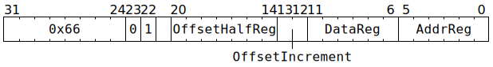

# `STOREIND` (MMIO register write from GPR)

**Summary:** Write 32 bits to a small window of the MMIO address space, with the value coming from a Tensix GPR. The instruction completes execution as soon as the write-request has been sent towards the MMIO device, at which point the thread's next instruction can execute. Note that until the write-request subsequently reaches the MMIO device, clients other than the Scalar Unit will not observe the write.

The MMIO address is formed using a pair of GPRs, one of which can be incremented as part of the instruction.

See also [`STOREREG`](STOREREG.md) for a similar instruction with a different addressing mode.

**Backend execution unit:** [Scalar Unit (ThCon)](ScalarUnit.md)

## Syntax

```c
TT_STOREIND(0, 1, 0, /* u7 */ OffsetHalfReg, /* u2 */ OffsetIncrement, /* u6 */ DataReg, /* u6 */ AddrReg)
```

## Encoding



## Functional model

```c
uint16_t* Offset = (char*)&GPRs[CurrentThread][0] + OffsetHalfReg * 2;
uint32_t Addr = GPRs[CurrentThread][AddrReg] + (*Offset >> 4);
Addr = 0xFFB00000 + (Addr & 0x000FFFFC);
if (Addr < 0xFFB11000) {
  UndefinedBehaviour();
}

*(uint32_t*)Addr = GPRs[CurrentThread][DataReg];

switch (OffsetIncrement) {
case 0: *Offset += 0; break;
case 1: *Offset += 2; break;
case 2: *Offset += 4; break;
case 3: *Offset += 16; break;
}
```

See the [memory map](../BabyRISCV/README.md#memory-map) for details of what exists within the `0xFFB_____` range.

## Performance

The instruction occupies the Scalar Unit (ThCon) for at least three cycles, possibly longer if the memory subsystem is busy.
