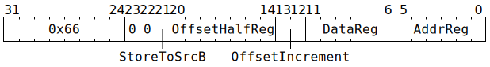

# `STOREIND` (SrcA/SrcB write 4xBF16 from 2xGPR)

**Summary:** Write four BF16 values to either [`SrcA` or `SrcB`](SrcASrcB.md), with the values coming from a pair of Tensix GPRs.

The index in to [`SrcA` or `SrcB`](SrcASrcB.md) is formed using a pair of GPRs, one of which can be incremented as part of the instruction. Various pieces of Unpacker state are also used as part of forming the index.

**Backend execution unit:** [Scalar Unit (ThCon)](ScalarUnit.md)

## Syntax

```c
TT_STOREIND(0,
            0,
            /* bool */ StoreToSrcB,
            /* u7 */ OffsetHalfReg,
            /* u2 */ OffsetIncrement,
            /* u6 */ DataReg,
            /* u6 */ AddrReg)
```

## Encoding



## Functional model

```c
uint19_t Datum[4];
Datum[0] = ReadBF16Lo(GPRs[CurrentThread][DataReg & 0x3c]);
Datum[1] = ReadBF16Hi(GPRs[CurrentThread][DataReg & 0x3c]);
Datum[2] = ReadBF16Lo(GPRs[CurrentThread][(DataReg & 0x3c) + 1]);
Datum[3] = ReadBF16Hi(GPRs[CurrentThread][(DataReg & 0x3c) + 1]);

uint16_t* Offset = (char*)&GPRs[CurrentThread][0] + OffsetHalfReg * 2;
uint20_t Addr = GPRs[CurrentThread][AddrReg] + (*Offset >> 4);
switch (OffsetIncrement) {
case 0: *Offset += 0; break;
case 1: *Offset += 2; break;
case 2: *Offset += 4; break;
case 3: *Offset += 16; break;
}
if (Addr & 0xf0000) {
  UndefinedBehaviour();
}

unsigned Column0 = (Addr & 3) * 4;
if (StoreToSrcB) {
  uint1_t Bank = Unpackers[1].SrcBank;
  while (SrcB[Bank].AllowedClient != SrcClient::Unpackers) {
    wait;
  }
  unsigned Row = Addr >> 2;
  if (Row >= 16) {
    UndefinedBehaviour();
  }
  Row += Unpackers[1].SrcRow[CurrentThread]; // Will add 0 / 16 / 32 / 48.
  for (unsigned i = 0; i < 4; ++i) {
    SrcB[Bank][Row][Column0 + i] = Datum[i];
  }
} else {
  uint1_t Bank = Unpackers[0].SrcBank;
  while (SrcA[Bank].AllowedClient != SrcClient::Unpackers) {
    wait;
  }
  int32_t Row = (int32_t)(Addr >> 2) - 4;
  if (Row >= 0) {
    if (ThreadConfig[CurrentThread].SRCA_SET_SetOvrdWithAddr) {
      if (Row >= 64) {
        UndefinedBehaviour();
      }
    } else {
      if (Row >= 16) {
        UndefinedBehaviour();
      }
      Row += Unpackers[0].SrcRow; // Will add 0 / 16 / 32 / 48.
    }
    for (unsigned i = 0; i < 4; ++i) {
      SrcA[Bank][Row][Column0 + i] = Datum[i];
    }
  }
}
```

Supporting definitions:
```c
uint19_t ReadBF16Lo(uint32_t x) {
  // Low 16 bits contain Sign(1b),Man(7b),Exp(8b)
  // Src holds BF16 as Sign(1b),Man(10b),Exp(8b)
  uint32_t Sign = x & 0x8000;
  uint32_t Man  = x & 0x7f00;
  uint32_t Exp  = x & 0x00ff;
  return (Sign << 3) | (Man << 3) | Exp;
}

uint19_t ReadBF16Hi(uint32_t x) {
  // High 16 bits contain Sign(1b),Exp(8b),Man(7b)
  // Src holds BF16 as Sign(1b),Man(10b),Exp(8b)
  uint32_t Sign = x >> 31;
  uint32_t Exp  = (x >> 23) & 0xff;
  uint32_t Man  = (x >> 16) & 0x7f;
  return (Sign << 18) | (Man << 11) | Exp;
}
```

## Performance

The instruction occupies the Scalar Unit (ThCon) for at least three cycles, possibly longer if waiting for `AllowedClient` to change.
