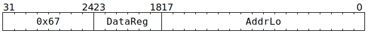

# `STOREREG` (MMIO register write from GPR)

**Summary:** Write 32 bits to a small window of the MMIO address space, with the value coming from a Tensix GPR. The instruction completes execution as soon as the write-request has been sent towards the MMIO device, at which point the thread's next instruction can execute. Note that until the write-request subsequently reaches the MMIO device, clients other than the Scalar Unit will not observe the write.

See also [`STOREIND`](STOREIND_MMIO.md) for a similar instruction with a different addressing mode.

**Backend execution unit:** [Scalar Unit (ThCon)](ScalarUnit.md)

## Syntax

```c
TT_STOREREG(/* u6 */ DataReg, /* u18 */ AddrLo)
```

## Encoding



## Functional model

```c
uint32_t Addr = 0xFFB00000 + (AddrLo << 2);
if (Addr < 0xFFB11000) {
  UndefinedBehaviour();
}

*(uint32_t*)Addr = GPRs[CurrentThread][DataReg];
```

See the [memory map](../BabyRISCV/README.md#memory-map) for details of what exists within the `0xFFB_____` range.

## Performance

The instruction occupies the Scalar Unit (ThCon) for at least three cycles, possibly longer if the memory subsystem is busy.
