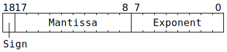
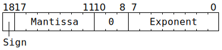
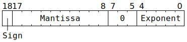
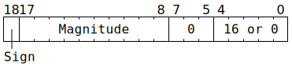
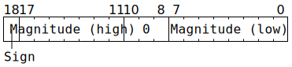

# `SrcA` and `SrcB`

Each of `SrcA` and `SrcB` can be viewed as having 2 banks of 64 rows of 16 columns of 19-bit data. They are best considered as a temporary staging area for Matrix Unit (FPU) computation instruction operands: load up to 64 rows in to each, execute some Matrix Unit (FPU) instructions to consume those rows, load up a completely new set of up to 64 rows in to either (or both), execute some Matrix Unit (FPU) instructions to consume them, rinse and repeat. The two banks allow the Unpackers to be writing to one bank while the Matrix Unit (FPU) is using the other bank. Instruction descriptions assume the following definition of `SrcA` and `SrcB`:

```c
enum class SrcClient {
  MatrixUnit,
  Unpackers,
};
struct {
  SrcClient AllowedClient = SrcClient::Unpackers;
  uint19_t Rows[64][16];
} SrcA[2], SrcB[2];
```

Instruction descriptions use the shorthand `SrcA[Bank][Row][Column]` to mean `SrcA[Bank].Rows[Row][Column]`, and similarly for `SrcB`.

The functional units capable of accessing `SrcA` and `SrcB` all keep one bit of state for tracking which bank they're currently using:
```c
uint1_t MatrixUnit::SrcABank = 0;
uint1_t MatrixUnit::SrcBBank = 0;
uint1_t Unpackers[0]::SrcBank = 0; // For SrcA
uint1_t Unpackers[1]::SrcBank = 0; // For SrcB
```

## Data types

Each datum in `SrcA` or `SrcB` is up to 19 bits wide, holding one of:
* **TF32 (1 sign bit, 8 bit exponent, 10 bit mantissa)**. FP32 can be converted to TF32, though the conversion involves throwing away the low 13 bits of mantissa.
* **BF16 (1 sign bit, 8 bit exponent, 7 bit mantissa)**. Unpackers can losslessly convert BFP8 / BFP4 / BFP2 to BF16. Internally, this type is overlaid on to TF32, with the three least significant bits of the TF32 mantissa set to zero.
* **FP16 (1 sign bit, 5 bit exponent, 10 bit mantissa)**. Unpackers can losslessly convert FP8 (1 sign bit, 5 bit exponent, 3 bit mantissa) to FP16. They can also losslessly convert BFP8a / BFP4a / BFP2a to FP16.
* **Integer "8" (1 sign bit, 10 bit magnitude)**. The range of this type is -1023 through +1023, albeit the majority of hardware conversions to/from this type involve a range of -127 through +127 or 0 through 255. Internally, this type is overlaid on to FP16, using a fixed raw exponent of 16 (or sometimes a raw exponent of 0 when the magnitude is zero).
* **Integer "16" (1 sign bit, 15 bit magnitude)**. This type is intended only for opaque data transfer of 16 bits; there are no computation instructions involving this type. If used for opaque data transfer, this type can be used to contain _any_ 16 bits, including unsigned 16-bit data.

Note that the coprocessor does not entirely conform to IEEE 754 for TF32 / BF16 / FP16. See [floating-point bit patterns](FloatBitPatterns.md) for details.

For matrix multiplication operations (`Dst += SrcB @ SrcA`), the supported data type _combinations_ are:

|[`Dst`](Dst.md) data type|+=|`SrcB` data type|@|`SrcA` data type|
|---|---|---|---|---|
|8x16 matrix of either FP32 or BF16|+=|8x16 matrix of either TF32 or BF16|@|16x16 matrix of either TF32 (†) or BF16|
|8x16 matrix of either FP32 or FP16|+=|8x16 matrix of FP16|@|16x16 matrix of FP16 (†)|
|8x16 matrix of integer "32"|+=|8x16 matrix of integer "8"|@|16x16 matrix of integer "8" (‡)|

(†) For `SrcA`, the least significant bit of the FP16 or TF32 mantissa is ignored in multiplication operations.

(‡) For `SrcA`, the most significant two bits of the integer "8" magnitude are ignored in multiplication operations, leaving just the low eight bits of magnitude. The usable values are therefore -255 through +255.

## Data type bit layout

Most of the time, software does not need to care about the exact bit layout of types in `SrcA` or `SrcB`. Nevertheless, the information is provided here to clarify the semantics of what happens if software does an implicit `bitcast` from one type to another.

**TF32:**



**BF16:**



**FP16:**



The representation of infinity differs from IEEE 754, and NaN is not supported; see [FP16 bit patterns](FloatBitPatterns.md#fp16) for details.

**Integer "8":**



The low five bits usually contain the value `16`, but unpackers will instead set these bits to `0` when the magnitude is zero.

**Integer "16":**



If using [`MOVA2D`](MOVA2D.md) or [`MOVB2D`](MOVB2D.md) with this type, `ALU_ACC_CTRL_Zero_Flag_disabled_src` should be set, as otherwise the high 11 bits will be treated as zero when the low 8 bits are zero.

## Fidelity phases (floating-point)

For multiplication operations ([`MVMUL`](MVMUL.md), [`GAPOOL`](GAPOOL.md), [`DOTPV`](DOTPV.md), [`ELWMUL`](ELWMUL.md)) involving floating-point types in `SrcA` / `SrcB`, software can make a performance versus precision tradeoff by varying which fidelity phases it chooses to use:

|`SrcA` / `SrcB` data type|Phases for minimal precision|Phases for "reasonable" precision|Phases for full precision|
|---|---|---|---|
|FP8, BFP4, BFP4a, BFP2, BFP2a|Just phase 0|Just phase 0|Just phase 0|
|BFP8, BFP8a|Just phase 0|Just phase 0|Phases 0 and 1|
|BF16|Just phase 0|Phases 0 and 1|All four phases|
|TF32, FP16|Just phase 0|All four phases|Not possible for `SrcA`|

Note that floating-point data in `Dst` is handled with full precision (FP32 / BF16 / FP16) regardless of fidelity phase.

The exact mantissa bits consumed by the various fidelity phases depend on the data type. For BF16 data type (including BFP8 / BFP4 / BFP2 losslessly converted to BF16):

<table><tr><th/><th><code>SrcA</code></th><th><code>SrcB</code></th></tr>
<tr><th>Phase&nbsp;0</th><td>Implicit <code>1</code> bit and most significant four mantissa bits</td><td>Implicit <code>1</code> bit and most significant six mantissa bits</td></tr>
<tr><th>Phase&nbsp;1</th><td>Remaining three mantissa bits</td><td>Implicit <code>1</code> bit and most significant six mantissa bits</td></tr>
<tr><th>Phase&nbsp;2</th><td>Implicit <code>1</code> bit and most significant four mantissa bits</td><td>Remaining mantissa bit</td></tr>
<tr><th>Phase&nbsp;3</th><td>Remaining three mantissa bits</td><td>Remaining mantissa bit</td></tr></table>

Meanwhile, for TF32 and FP16 data types (including FP8 / BFP8a / BFP4a / BFP2a losslessly converted to FP16):

<table><tr><th/><th><code>SrcA</code></th><th><code>SrcB</code></th></tr>
<tr><th>Phase&nbsp;0</th><td>Implicit <code>1</code> bit and most significant four mantissa bits</td><td>Implicit <code>1</code> bit and most significant six mantissa bits</td></tr>
<tr><th>Phase&nbsp;1</th><td>Next five mantissa bits (†)</td><td>Implicit <code>1</code> bit and most significant six mantissa bits</td></tr>
<tr><th>Phase&nbsp;2</th><td>Implicit <code>1</code> bit and most significant four mantissa bits</td><td>Remaining four mantissa bits</td></tr>
<tr><th>Phase&nbsp;3</th><td>Next five mantissa bits (†)</td><td>Remaining four mantissa bits</td></tr></table>

(†) For `SrcA`, this leaves the one remaining least significant mantissa bit, which is not consumed by any fidelity phase.

## Fidelity phases (integer)

For multiplication operations ([`MVMUL`](MVMUL.md), [`GAPOOL`](GAPOOL.md), [`DOTPV`](DOTPV.md), [`ELWMUL`](ELWMUL.md)) involving integer types in `SrcA` / `SrcB`, software can get increased performance by skipping fidelity phases if it knows bounds on the magnitude of the input data in `SrcA` / `SrcB`:

<table><tr><th/><th><code>abs(SrcB) ≤ 15</code></th><th><code>abs(SrcB) ≤ 1023</code></th></tr>
<tr><th align="left"><code>abs(SrcA) ≤ 31</code></th><td>Just phase 3</td><td>Phases 1 and 3</td></tr>
<tr><th align="left"><code>abs(SrcA) ≤ 255</code></th><td>Phases 2 and 3</td><td>All four phases</td></tr></table>

Note that integer data in `Dst` is handled with full precision (integer "32") regardless of fidelity phase.

The exact magnitude bits consumed by the various fidelity phases for integer "8" data type:

<table><tr><th/><th><code>SrcA</code></th><th><code>SrcB</code></th></tr>
<tr><th>Phase&nbsp;3</th><td>Least significant five bits of magnitude</td><td>Least significant four bits of magnitude</td></tr>
<tr><th>Phase&nbsp;2</th><td>Next three bits of magnitude (‡)</td><td>Least significant four bits of magnitude</td></tr>
<tr><th>Phase&nbsp;1</th><td>Least significant five bits of magnitude</td><td>Remaining six bits of magnitude</td></tr>
<tr><th>Phase&nbsp;0</th><td>Next three bits of magnitude (‡)</td><td>Remaining six bits of magnitude</td></tr></table>

(‡) For `SrcA`, this leaves the two remaining most significant magnitude bits, which are not consumed by any fidelity phase.


