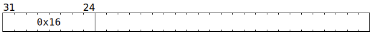
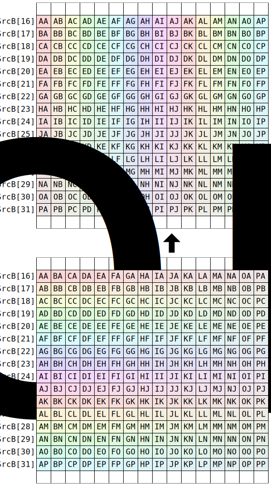

# `TRNSPSRCB` (Transpose `SrcB[16:32]`)

**Summary:** Transposes the 16x16 matrix present in `SrcB` rows 16 (inclusive) through 32 (exclusive).

**Backend execution unit:** [Matrix Unit (FPU)](MatrixUnit.md)

## Syntax

```c
TTI_TRNSPSRCB
```

## Encoding



## Cross-lane data movement pattern



## Functional model

This instruction will, if necessary, spend time waiting at the Wait Gate before being dispatched to the Matrix Unit (FPU):

```c
while (SrcB[MatrixUnit.SrcBBank].AllowedClient != MatrixUnit) {
  wait;
}
```

Once dispatched to the Matrix Unit (FPU):
```c
uint6_t RowBase = 16;
for (unsigned i = 0; i < 16; ++i) {
  for (unsigned j = 0; j < i; ++j) {
    uint19_t ij = SrcB[MatrixUnit.SrcBBank][RowBase + i][j];
    uint19_t ji = SrcB[MatrixUnit.SrcBBank][RowBase + j][i];
    SrcB[MatrixUnit.SrcBBank][RowBase + i][j] = ji;
    SrcB[MatrixUnit.SrcBBank][RowBase + j][i] = ij;
  }
}
```
