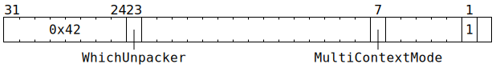

# `UNPACR` (Flush unpacker decompression row start cache)

**Summary:**

**Backend execution unit:** Unpackers

## Syntax

```c
TT_OP_UNPACR(/* u1 */ WhichUnpacker,
             0,
             false,
             0,
             0,
             /* bool */ MultiContextMode,
             false,
             false,
             false,
             false,
             false,
             true,
             false)
```

## Encoding



## Functional model

The cache is not modelled, so no functional model is provided. The physical manifestation of Wormhole has four one-entry caches per unpacker. When `MultiContextMode` is `true`, all four are cleared. Otherwise, just the cache for the current thread is cleared.
