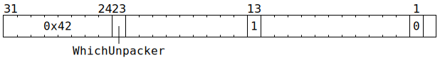

# `UNPACR` (Increment context counter)

**Summary:**

**Backend execution unit:** [Unpackers](Unpackers/README.md)

## Syntax

```c
TT_OP_UNPACR(/* u1 */ WhichUnpacker,
             0,
             true,
             0,
             0,
             false,
             false,
             false,
             false,
             false,
             false,
             false)
```

## Encoding



## Functional model

```c
uint1_t StateID = ThreadConfig[CurrentThread].CFG_STATE_ID_StateID;
auto& ConfigState = Config[StateID];
auto& CurrentUnpacker = Unpackers[WhichUnpacker];

uint3_t WhichContext = CurrentUnpacker.ContextCounter[CurrentThread];
uint3_t IncrementedCounter = WhichContext + 1;
if (IncrementedCounter >= (1 << ConfigState.THCON_SEC[WhichUnpacker].Context_count)) {
  IncrementedCounter = 0;
}
CurrentUnpacker.ContextCounter[CurrentThread] = IncrementedCounter;
```
