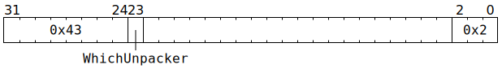

# `UNPACR_NOP` (Occupy Unpacker for one cycle)

**Backend execution unit:** [Unpackers](Unpackers/README.md)

## Syntax

```c
TT_UNPACR_NOP(/* u1 */ WhichUnpacker, 0x2)
```

## Encoding



## Functional model

```c
// Causes no effects
```
