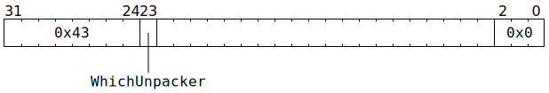
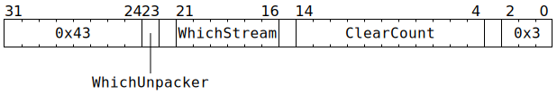

# `UNPACR_NOP` (MMIO register write to Overlay `STREAM_MSG_DATA_CLEAR_REG_INDEX`, sequenced with UNPACR)

**Backend execution unit:** Unpackers

## Syntax

```c
TT_UNPACR_NOP(/* u1 */ WhichUnpacker, 0x0)
TT_UNPACR_NOP(/* u1 */ WhichUnpacker,
            ((/* u6 */ WhichStream) << 16) +
            ((/* u11 */ ClearCount) << 4) +
             0x3)
```

## Encoding




## Functional model

```c
uint6_t StreamId;
if (ClearCount != 0) {
  StreamId = WhichStream;
} else {
  StreamId = ThreadConfig[CurrentThread].NOC_OVERLAY_MSG_CLEAR_StreamId[WhichUnpacker];
}
NOC_STREAM_WRITE_REG(StreamId, STREAM_MSG_DATA_CLEAR_REG_INDEX, 1);
```

See [Overlay streams transmitting to software](../../NoC/Overlay/TransmitToSoftware.md) for context around `STREAM_MSG_DATA_CLEAR_REG_INDEX`.
