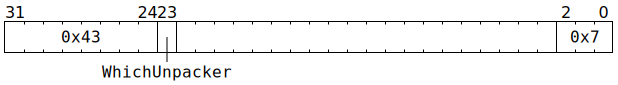

# `UNPACR_NOP` (Give `SrcA` or `SrcB` banks to Matrix Unit, sequenced with UNPACR)

**Backend execution unit:** Unpackers

## Syntax

```c
TT_UNPACR_NOP(/* u1 */ WhichUnpacker, 0x7)
```

## Encoding



## Functional model

```c
if (WhichUnpacker == 0) {
  SrcA[Unpackers[0].SrcBank].AllowedClient = SrcClient::MatrixUnit;
  Unpackers[0].SrcBank ^= 1;
  Unpackers[0].SrcRow[CurrentThread] = ThreadConfig[CurrentThread].SRCA_SET_Base << 4;
} else {
  SrcB[Unpackers[1].SrcBank].AllowedClient = SrcClient::MatrixUnit;
  Unpackers[1].SrcBank ^= 1;
  Unpackers[1].SrcRow[CurrentThread] = ThreadConfig[CurrentThread].SRCB_SET_Base << 4;
}
```
