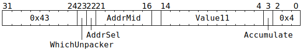

# `UNPACR_NOP` (MMIO register write sequenced with UNPACR)

**Summary:** Once previous `UNPACR` instructions have finished their L1 reads, perform a 32-bit memory write within a small window of the MMIO address space.

**Backend execution unit:** [Unpackers](Unpackers/README.md)

## Syntax

```c
TT_UNPACR_NOP(/* u1 */ WhichUnpacker,
            ((/* u1 */ AddrSel) << 22) +
            ((/* u6 */ AddrMid) << 16) +
            ((/* u11 */ Value11) << 4) +
            ((/* bool */ Accumulate) << 3) +
             0x4)
```

## Encoding



## Functional model

Once all previous `UNPACR` instructions with the same value for `WhichUnpacker` have finished their L1 reads, the following happens:

```c
uint32_t Addr = 0xFFB00000 + Unpackers.SetRegBase[AddrSel] + (AddrMid << 12);

if (Accumulate) {
  uint32_t AccValue = Unpackers[WhichUnpacker].SetRegAcc;
  if (Value11 == 0) {
    AccValue = 0;
  } else {
    AccValue = (AccValue + Value11) & 0x1ffff;
    *(uint32_t*)Addr = AccValue;
  }
  Unpackers[WhichUnpacker].SetRegAcc = AccValue;
} else {
  *(uint32_t*)Addr = Value11;
}
```

The `SetRegBase` field is set via TDMA-RISC, rather than being traditional backend configuration. TDMA-RISC can also be used to sample the value of `SetRegAcc`.

The bits of `Addr` will consist of 12 fixed bits (`0xFFB`), two bits from `SetRegBase`, six bits from `AddrMid`, ten more bits from `SetRegBase`, then two fixed bits (`0b00`). See the [memory map](../BabyRISCV/README.md#memory-map) for details of what exists within this range.
