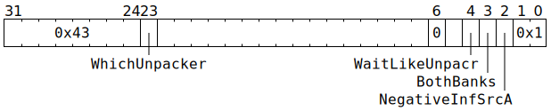

# `UNPACR_NOP` (Set `SrcA` or `SrcB` to zero, sequenced with UNPACR)

**Backend execution unit:** [Unpackers](Unpackers/README.md)

## Syntax

```c
TT_UNPACR_NOP(/* u1 */ WhichUnpacker,
            ((/* bool */ WaitLikeUnpacr) << 4) +
            ((/* bool */ BothBanks) << 3) +
            ((/* bool */ NegativeInfSrcA) << 2) +
             0x1)
```

## Encoding



## Functional model

```c
uint1_t UnpackBank = Unpackers[WhichUnpacker].SrcBank;

// Wait for bank access.
if (WhichUnpacker == 0) {
  while (SrcA[WaitLikeUnpacr ? UnpackBank : MatrixUnit.SrcABank].AllowedClient != SrcClient::Unpackers) {
    wait;
  }
} else {
  while (SrcB[WaitLikeUnpacr ? UnpackBank : MatrixUnit.SrcBBank].AllowedClient != SrcClient::Unpackers) {
    wait;
  }
}

// Do the clearing.
for (unsigned Bank = 0; Bank < 2; ++Bank) {
  if (BothBanks || Bank == UnpackBank) {
    if (WhichUnpacker == 0) {
      uint19_t ClearVal = NegativeInfSrcA ? ~0u : 0u;
      for (unsigned i = 0; i < 64; ++i) {
        for (unsigned j = 0; j < 16; ++j) {
          SrcA[Bank][i][j] = ClearVal;
        }
      }
    } else {
      for (unsigned i = 0; i < 64; ++i) {
        for (unsigned j = 0; j < 16; ++j) {
          SrcB[Bank][i][j] = 0u;
        }
      }
    }
  }
}
```
