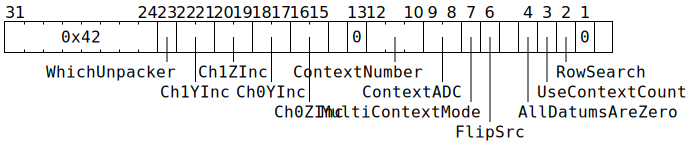

# `UNPACR` (Move datums from L1 to `SrcA` or `SrcB` or `Dst`)

**Summary:** Issue work to one unpacker, moving some number of datums from L1 to [`SrcA` or `SrcB`](SrcASrcB.md) or [`Dst`](Dst.md).

**Backend execution unit:** [Unpackers](Unpackers/README.md)

## Syntax

```c
TT_OP_UNPACR(/* u1 */ WhichUnpacker,
           ((/* u2 */ Ch1YInc) << 6) +
           ((/* u2 */ Ch1ZInc) << 4) +
           ((/* u2 */ Ch0YInc) << 2) +
             /* u2 */ Ch0ZInc,
             false,
             /* u3 */ ContextNumber,
             /* u2 */ ContextADC,
             /* bool */ MultiContextMode,
             /* bool */ FlipSrc,
             false,
             /* bool */ AllDatumsAreZero,
             /* bool */ UseContextCounter,
             /* bool */ RowSearch,
             false,
             false)
```

## Encoding



## Functional model

```c
// Start by reading some configuration:

uint1_t StateID = ThreadConfig[CurrentThread].CFG_STATE_ID_StateID;
auto& ConfigState = Config[StateID];
auto& CurrentUnpacker = Unpackers[WhichUnpacker];

uint3_t WhichContext;
uint2_t WhichADC;
if (MultiContextMode) {
  if (UseContextCounter) {
    WhichContext = CurrentUnpacker.ContextCounter[CurrentThread];
  } else {
    WhichContext = ContextNumber;
  }
  WhichContext += ThreadConfig[CurrentThread].UNPACK_MISC_CFG_CfgContextOffset[WhichUnpacker];
  WhichADC = ContextADC;
  if (WhichUnpacker == 1 && WhichContext >= 2) UndefinedBehaviour();
  if (WhichADC == 3) UndefinedBehaviour();
} else {
  WhichContext = 0;
  WhichADC = CurrentThread;
}

// Determine initial input address(es) and input datum count:

auto& ConfigDescriptor = ConfigState.THCON_SEC[WhichUnpacker].TileDescriptor;

bool IsUncompressed;
if (MultiContextMode) {
  IsUncompressed = ConfigState.THCON_SEC[WhichUnpacker].Disable_zero_compress_cntx[WhichContext];
} else {
  IsUncompressed = ConfigDescriptor.IsUncompressed;
}

uint16_t XDim;
if (MultiContextMode && WhichUnpacker == 0) {
  XDim = ConfigState.THCON_SEC[WhichUnpacker].Tile_x_dim_cntx[WhichContext & 3];
} else {
  XDim = ConfigDescriptor.XDim;
}
uint8_t YDim = ConfigDescriptor.YDim;
uint8_t ZDim = ConfigDescriptor.ZDim ? ConfigDescriptor.ZDim : 1;
uint8_t WDim = ConfigDescriptor.WDim ? ConfigDescriptor.WDim : 1;

uint4_t InDataFormat;
uint4_t OutDataFormat;
if (MultiContextMode && ConfigState.THCON_SEC[WhichUnpacker].Ovrd_data_format) {
  InDataFormat  = ConfigState.THCON_SEC[WhichUnpacker].Unpack_data_format_cntx[WhichContext];
  OutDataFormat = ConfigState.THCON_SEC[WhichUnpacker].Unpack_out_data_format_cntx[WhichContext];
} else {
  InDataFormat  = ConfigDescriptor.InDataFormat;
  OutDataFormat = ConfigState.THCON_SEC[WhichUnpacker].REG2_Out_data_format;
}
float DatumSizeBytes;
switch (InDataFormat) {
case BFP2: case BFP2a:            DatumSizeBytes = 0.25; break;
case BFP4: case BFP4a:            DatumSizeBytes = 0.5; break;
case BFP8: case BFP8a:            DatumSizeBytes = 1; break;
case FP8:             case INT8:  DatumSizeBytes = 1; break;
case FP16: case BF16: case INT16: DatumSizeBytes = 2; break;
case FP32: case TF32: case INT32: DatumSizeBytes = 4; break;
}

unsigned InAddr;
if (MultiContextMode && WhichContext != 0) {
  InAddr = ConfigState.THCON_SEC[WhichUnpacker].Base_cntx[WhichContext].address
         +(ConfigState.THCON_SEC[WhichUnpacker].Offset_cntx[WhichContext & 3].address & 0xffff);
} else {
  InAddr = ConfigState.THCON_SEC[WhichUnpacker].Base_address
         +(ConfigState.THCON_SEC[WhichUnpacker].Offset_address & 0xffff);  
}
InAddr = (InAddr + 1 + ConfigDescriptor.DigestSize) * 16;

uint16_t* InAddr_RowStart = undefined;
if (!IsUncompressed) {
  InAddr_RowStart = InAddr;
  if (ConfigDescriptor.BlobsPerXYPlane) {
    auto NumBlobs = ConfigDescriptor.BlobsPerXYPlane * ZDim * WDim;
    InAddr += ceil((NumBlobs + 1) * sizeof(uint16_t) / 16.) * 16;
  } else {
    auto NumRows = YDim * ZDim * WDim;
    InAddr += ceil((NumRows + 1) * sizeof(uint16_t) / 16.) * 16;
  }
}

double InAddr_Exponents = undefined;
if (IsBFPFormat(InDataFormat) && !ConfigState.THCON_SEC[WhichUnpacker].Force_shared_exp) {
  InAddr_Exponents = InAddr;
  if (InDataFormat == BFP8 || InDataFormat == BFP8a || !ConfigDescriptor.NoBFPExpSection) {
    auto NumElements = XDim * YDim * ZDim * WDim;
    auto NumExponents = ceil(NumElements / 16.);
    InAddr += ceil(NumExponents / 16.) * 16;
  }
}

unsigned FirstDatum;
unsigned InputNumDatums;
unsigned DecompressDrop = 0;
unsigned DecompressNumDatums = UINT32_MAX;
auto& ADC_XY = ADCs[WhichADC     ].Unpacker[WhichUnpacker].Channel[0];
auto& ADC_ZW = ADCs[CurrentThread].Unpacker[WhichUnpacker].Channel[0];
if (IsUncompressed) {
  unsigned XPos;
  unsigned YPos;
  unsigned XEnd;
  if (!RowSearch) {
    XPos = ADC_XY.X;
    YPos = ADC_XY.Y;
    XEnd = ADCs[WhichADC].Unpacker[WhichUnpacker].Channel[1].X + 1;
  } else if (ConfigDescriptor.BlobsPerXYPlane) {
    uint4_t BlobsYStart[8];
    if (MultiContextMode && WhichUnpacker == 0) {
      BlobsYStart = ConfigState.UNP0_BLOBS_Y_START_CNTX[WhichContext & 2].blobs_y_start;
    } else {
      BlobsYStart = ConfigDescriptor.BlobsYStart;
    }
    XPos = BlobsYStart[ADC_XY.Y & 7] << 4;
    YPos = 0;
    unsigned X71 = (ADC_XY.X & 7) + 1;
    if (X71 == ConfigDescriptor.BlobsPerXYPlane) {
      XEnd = XDim & 0x1f0;
    } else {
      XEnd = BlobsYStart[X71] << 4;
    }
  } else {
    XPos = 0;
    YPos = ADC_XY.Y;
    XEnd = ADCs[WhichADC].Unpacker[WhichUnpacker].Channel[1].X;
  }
  FirstDatum = ((ADC_ZW.W * ZDim + ADC_ZW.Z) * YDim + YPos) * XDim + XPos;
  InputNumDatums = XEnd - XPos;
} else {
  if (RowSearch && ConfigDescriptor.BlobsPerXYPlane) YDim = ConfigDescriptor.BlobsPerXYPlane;
  InAddr_RowStart += (ADC_ZW.W * ZDim + ADC_ZW.Z) * YDim;
  FirstDatum = InAddr_RowStart[ADC_XY.Y & 0xff];
  if (RowSearch) {
    InputNumDatums = InAddr_RowStart[(ADC_XY.X & 0xff) + 1] - FirstDatum;
  } else if (ADC_XY.X == 0 && ADCs[WhichADC].Unpacker[WhichUnpacker].Channel[1].X == XDim-1) {
    InputNumDatums = InAddr_RowStart[(ADC_XY.Y & 0xff) + 1] - FirstDatum;
  } else {
    DecompressDrop = ADC_XY.X;
    DecompressNumDatums = ADCs[WhichADC].Unpacker[WhichUnpacker].Channel[1].X + 1 - DecompressDrop;
    InputNumDatums = UINT32_MAX; // Using DecompressNumDatums instead.
  }
}

double InAddr_Datums = InAddr;
double InAddr_Deltas;
InAddr_Exponents += FirstDatum / 16.;
if (IsUncompressed) {
  InAddr_Datums += FirstDatum * DatumSizeBytes;
  InAddr_Deltas = undefined;
} else {
  InAddr_Datums += (FirstDatum / 32) * (32 * DatumSizeBytes + 32 * 0.5);
  InAddr_Deltas = InAddr_Datums + 32 * DatumSizeBytes;
  InAddr_Datums += (FirstDatum % 32) * DatumSizeBytes;
  InAddr_Deltas += (FirstDatum % 32) * 0.5;
}

auto WrapAddr = [&](auto addr) {
  if (addr > ConfigState.THCON_SEC[WhichUnpacker].Unpack_limit_address * 16) {
    addr -= ConfigState.THCON_SEC[WhichUnpacker].Unpack_fifo_size * 16;
  }
  return addr;
};
InAddr_Exponents = WrapAddr(InAddr_Exponents);
InAddr_Datums = WrapAddr(InAddr_Datums);
InAddr_Deltas = WrapAddr(InAddr_Deltas);

bool DiscontiguousInputRows = ConfigState.THCON_SEC[WhichUnpacker].Tileize_mode;
if (DiscontiguousInputRows) {
  RowStride = (ConfigState.UNP[WhichUnpacker].Shift_amount_cntx[0] <<  4)
            | (ConfigState.UNP[WhichUnpacker].Shift_amount_cntx[1] <<  8)
            | (ConfigState.UNP[WhichUnpacker].Shift_amount_cntx[2] << 12);
  // Note that each Shift_amount_cntx is a 4-bit field, so there's 12 bits of
  // precision here, and therefore the maximum RowStride is 65520 bytes.
} else {
  RowStride = DatumSizeBytes * 16;
}

// Determine initial output address:

bool UnpackToDst;
bool Transpose;
if (WhichUnpacker == 0) {
  if (MultiContextMode) {
    UnpackToDst = ConfigState.THCON_SEC[WhichUnpacker].Unpack_if_sel_cntx[WhichContext];
  } else {
    UnpackToDst = ConfigState.THCON_SEC[WhichUnpacker].Unpack_If_Sel;
  }
  Transpose = ConfigState.THCON_SEC[WhichUnpacker].Haloize_mode;
} else {
  UnpackToDst = false;
  Transpose = false;
}

auto& ADC_Out = ADCs[CurrentThread].Unpacker[WhichUnpacker].Channel[1];
unsigned OutAddr = ConfigState.UNP[WhichUnpacker].ADDR_BASE_REG_1_Base
     + ADC_Out.Y * ConfigState.UNP[WhichUnpacker].ADDR_CTRL_XY_REG_1_Ystride
     + ADC_Out.Z * ConfigState.UNP[WhichUnpacker].ADDR_CTRL_XY_REG_1_Zstride
     + ADC_Out.W * ConfigState.UNP[WhichUnpacker].ADDR_CTRL_XY_REG_1_Wstride;
if (OutDataFormat in {FP32, TF32, INT32}) {
  if (OutAddr & 3) UndefinedBehaviour();
  OutAddr >>= 2;
} else if (OutDataFormat in {FP16, BF16, INT16}) {
  if (OutAddr & 1) UndefinedBehaviour();
  OutAddr >>= 1;
}
if (MultiContextMode && WhichUnpacker == 0) {
  unsigned CtxOutAddr = ConfigState.THCON_SEC[WhichUnpacker].Dest_cntx[WhichContext & 3].address;
  if (UnpackToDst || ConfigState.UNP[WhichUnpacker].ADD_DEST_ADDR_CNTR_add_dest_addr_cntr) {
    OutAddr += CtxOutAddr;
  } else {
    OutAddr = CtxOutAddr;
  }
}

uint4_t UpsampleZeroes = (1 << ConfigState.THCON_SEC[WhichUnpacker].Upsample_rate) - 1;
bool UpsampleInterleave = ConfigState.THCON_SEC[WhichUnpacker].Upsample_and_interleave;
uint4_t ColShift;
if (DiscontiguousInputRows || WhichUnpacker == 1) {
  ColShift = 0;
} else {
  ColShift = ConfigState.UNP[WhichUnpacker].Shift_amount_cntx[WhichContext & 3];
}

// Check that various settings are compatible with each other:

if (Transpose || DiscontiguousInputRows) {
  // These modes require that InAddr_Datums start at an aligned 16 byte boundary.
  if (InAddr_Datums != floor(InAddr_Datums / 16.) * 16.) {
    UndefinedBehaviour();
  }
}
if (DiscontiguousInputRows && (UpsampleZeroes > 0 || !IsUncompressed)) {
  UndefinedBehaviour();
}
if (UnpackToDst && (ColShift || Transpose)) {
  UndefinedBehaviour();
}

// Main unpack loop:

for (unsigned i = 0; i < InputNumDatums && DecompressNumDatums; ) {
  // Read a datum from L1:
  auto DatumBits = ReadL1Bytes(InAddr_Datums, DatumSizeBytes);
  InAddr_Datums += DatumSizeBytes;
  if ((++i % 16) == 0) {
    InAddr_Datums -= DatumSizeBytes * 16;
    InAddr_Datums += RowStride;
    InAddr_Datums = WrapAddr(InAddr_Datums);
  }
  uint8_t ExpBits = undefined;
  if (IsBFPFormat(InDataFormat)) {
    if (ConfigState.THCON_SEC[WhichUnpacker].Force_shared_exp) {
      ExpBits = ConfigState.UNP[WhichUnpacker].FORCE_SHARED_EXP_shared_exp;
    } else {
      ExpBits = ReadL1Bytes(floor(InAddr_Exponents), 1);
      InAddr_Exponents += 1 / 16.;
      if (InAddr_Exponents == floor(InAddr_Exponents / 16.) * 16.) {
        InAddr_Exponents = WrapAddr(InAddr_Exponents);
      }
    }
  }
  uint4_t DecompressionZeroes = 0;
  if (!IsUncompressed) {
    DecompressionZeroes = ReadL1Bytes(InAddr_Deltas, 0.5);
    InAddr_Deltas += 0.5;
    if (InAddr_Deltas == floor(InAddr_Deltas / 16.) * 16.) {
      InAddr_Datums += 16;                  // Skip over 32 deltas
      InAddr_Deltas += 32 * DatumSizeBytes; // Skip over 32 datums
      InAddr_Deltas = WrapAddr(InAddr_Deltas);
    }
  }
  // Do the format conversion:
  uint32_t Datum = FormatConversion(InDataFormat, OutDataFormat, DatumBits, ExpBits, WhichUnpacker, UnpackToDst);
  if (AllDatumsAreZero) {
    Datum = 0;
    DecompressionZeroes = 0;
  }
  // Write the datum out to SrcA / SrcB / Dst, along with any zeroes
  // resulting from decompression and from upsampling:
  for (unsigned j = 0; j <= DecompressionZeroes; ++j, Datum = 0) {
    if (DecompressDrop) {--DecompressDrop; continue;}
    for (unsigned k = 0; k <= UpsampleZeroes; ++k, Datum = 0, ++OutAddr) {
      if (UpsampleInterleave && k != 0) continue;
      uint1_t Bank = CurrentUnpacker.SrcBank;
      unsigned Row = (OutAddr / 16);
      uint4_t Col = OutAddr & 15;
      if (WhichUnpacker == 1) {
        // Write to SrcB:
        while (SrcB[Bank].AllowedClient != SrcClient::Unpackers) {
          wait;
        }
        Row = (Row + CurrentUnpacker.SrcRow[CurrentThread]) & 0x3f;
        SrcB[Bank][Row][Col] = Datum;
      } else {
        while (SrcA[Bank].AllowedClient != SrcClient::Unpackers) {
          wait;
        }
        if (!UnpackToDst) {
          // Write to SrcA:
          if (Row < 4 || Col < ColShift) continue;
          Row -= 4;
          Col -= ColShift;
          if (ThreadConfig[CurrentThread].SRCA_SET_SetOvrdWithAddr) {
            if (Row >= 64) UndefinedBehaviour();
          } else {
            if (Row >= 16) UndefinedBehaviour();
            Row += CurrentUnpacker.SrcRow[CurrentThread];
          }
          if (Transpose) {
            uint4_t RowLowBits = Row & 0xf;
            std::swap(RowLowBits, Col);
            Row = (Row & ~0xf) | RowLowBits;
          }
          SrcA[Bank][Row][Col] = Datum;
        } else {
          // Write to Dst:
          Row -= 4;
          if (ThreadConfig[CurrentThread].SRCA_SET_SetOvrdWithAddr) {
            Row &= 15;
          } else {
            Row &= 0x3ff;
          }
          if (OutDataFormat in {FP32, TF32, INT32}) {
            Dst32b[Row][Col] = Datum;
          } else {
            Dst16b[Row][Col] = Datum;
          }
        }
      }
    }
    if (--DecompressNumDatums == 0) break;
  }
}

// Update counters in preparation for next instruction:

if (MultiContextMode && UseContextCounter) {
  uint3_t IncrementedCounter = WhichContext + 1;
  if (IncrementedCounter >= (1 << ConfigState.THCON_SEC[WhichUnpacker].Context_count)) {
    IncrementedCounter = 0;
  }
  CurrentUnpacker.ContextCounter[CurrentThread] = IncrementedCounter;
}
for (unsigned i = 0; i < 3; ++i) {
  if (i == CurrentThread || i == WhichADC) {
    auto& Ch0 = ADCs[i].Unpacker[WhichUnpacker].Channel[0];
    Ch0.Y += Ch0YInc;
    Ch0.Z += Ch0ZInc;
    auto& Ch1 = ADCs[i].Unpacker[WhichUnpacker].Channel[1];
    Ch1.Y += Ch1YInc;
    Ch1.Z += Ch1ZInc;
  }
}
uint6_t SrcRowBase = (WhichUnpacker ? ThreadConfig[CurrentThread].SRCB_SET_Base : ThreadConfig[CurrentThread].SRCA_SET_Base) << 4;
if (FlipSrc) {
  (WhichUnpacker ? SrcB : SrcA)[CurrentUnpacker.SrcBank].AllowedClient = SrcClient::MatrixUnit;
  CurrentUnpacker.SrcBank ^= 1;
  CurrentUnpacker.SrcRow[CurrentThread] = SrcRowBase;
} else if (ConfigState.THCON_SEC[WhichUnpacker].Unpack_Src_Reg_Set_Upd) {
  CurrentUnpacker.SrcRow[CurrentThread] += 16 + SrcRowBase;
}
```

Supporting definitions:

```c
uint32_t ReadL1Bytes(double Addr, double NumBytes) {
  if (Addr < 0 || Addr >= (1464*1024)) UndefinedBehaviour(); // Address must be in L1
  uint32_t BitAddr = Addr * 8.;
  uint32_t NumBits = NumBytes * 8.;
  uint32_t Result = 0;
  for (uint32_t i = 0; i < NumBits; ++i, ++BitAddr) {
    uint32_t InByte = *(const uint8_t*)(BitAddr / 8);
    uint32_t InBit = (InByte >> (BitAddr & 7)) & 1;
    Result |= InBit << i;
  }
  return Result;
}

uint32_t FormatConversion(uint4_t InDataFormat, uint4_t OutDataFormat, uint32_t DatumBits, uint8_t ExpBits, uint1_t WhichUnpacker, bool UnpackToDst) {
  if (InDataFormat == FP32) {
    // Conversions are possible from FP32 to a few other types.
    switch (OutDataFormat) {
    case FP32:
      break;
    case TF32:
      if (UnpackToDst) {
        // When unpacking to Dst, TF32 means FP32.
        return WriteDstFP32(DatumBits);
      } else {
        return WriteSrcTF32(DatumBits >> 13);
      }
    case BF16:
      if (!(DatumBits & 0x7f800000)) DatumBits &= 0x80000000u; // Flush denormals to zero.
      DatumBits >>= 16;
      InDataFormat = BF16;
      break;
    case FP16:
      DatumBits = FP32ToFP16(DatumBits);
      InDataFormat = FP16;
      break;
    default:
      UndefinedBehaviour();
    }
  } else {
    // Exactly one conversion is permitted for all other input types. In these
    // cases, OutDataFormat has no meaning, but must be equal to InDataFormat.
    if (InDataFormat != OutDataFormat) UndefinedBehaviour();

    // Start by normalising to a format which is either 16 or 32 bits wide.
    switch (InDataFormat) {
    case FP8: DatumBits <<= 8; InDataFormat = FP16; break;
    case BFP8: DatumBits = BFP8ToBF16(DatumBits     , ExpBits); InDataFormat = BF16; break;
    case BFP4: DatumBits = BFP8ToBF16(DatumBits << 4, ExpBits); InDataFormat = BF16; break;
    case BFP2: DatumBits = BFP8ToBF16(DatumBits << 6, ExpBits); InDataFormat = BF16; break;
    case BFP8a: DatumBits = BFP8aToFP16(DatumBits     , ExpBits); InDataFormat = FP16; break;
    case BFP4a: DatumBits = BFP8aToFP16(DatumBits << 4, ExpBits); InDataFormat = FP16; break;
    case BFP2a: DatumBits = BFP8aToFP16(DatumBits << 6, ExpBits); InDataFormat = FP16; break;
    case INT8: {
      // INT8 is either uint8_t or 8 bit sign-magnitude, and becomes "Integer 8", which is
      // then overlaid onto FP16.
      uint1_t StateID = ThreadConfig[CurrentThread].CFG_STATE_ID_StateID;
      auto& ConfigState = Config[StateID];
      bool Int8MeansUnsigned = WhichUnpacker ? ConfigState.ALU_FORMAT_SPEC_REG0_SrcBUnsigned
                                             : ConfigState.ALU_FORMAT_SPEC_REG0_SrcAUnsigned;
      unsigned Sign = Int8MeansUnsigned ? 0 : DatumBits & 0x80;
      DatumBits -= Sign;
      if (DatumBits) DatumBits |= 16 << 10; // Dummy exponent as part of FP16 overlay.
      DatumBits |= Sign << 8;
      InDataFormat = FP16;
      break; }

    case TF32:
      if (UnpackToDst) {
        // When unpacking to Dst, TF32 means FP32.
        return WriteDstFP32(DatumBits);
      } else {
        // Otherwise, TF32 is not valid as InDataFormat (but software can instead
        // specify InDataFormat == FP32 and OutDataFormat == TF32).
        UndefinedBehaviour();
      }
    }
  }

  // All that's left is re-arranging bits to the format expected by Dst or by SrcA / SrcB.
  switch (InDataFormat) {
  case INT16: return UnpackToDst ? DatumBits : ((DatumBits & 0xff00) << 3) | (DatumBits & 0xff);
  case INT32: return UnpackToDst ? WriteDstFP32(DatumBits) : UndefinedBehaviour();
  case FP32:  return UnpackToDst ? WriteDstFP32(DatumBits) : UndefinedBehaviour();
  case BF16:  return UnpackToDst ? WriteDstBF16(DatumBits) : WriteSrcBF16(DatumBits);
  case FP16:  return UnpackToDst ? WriteDstFP16(DatumBits) : WriteSrcFP16(DatumBits);
  }
}

uint16_t BFP8ToBF16(uint8_t DatumBits, uint8_t ExpBits) {
  uint8_t Sign = DatumBits >> 7;
  uint8_t Mag  = DatumBits << 1;
  if (Mag == 0) {
    return Sign ? 0xff80 : 0;
  } else {
    unsigned LZ = stdc_leading_zeros_uc(Mag);
    Mag <<= LZ;
    ExpBits -= LZ;
    return (Sign << 15) | (ExpBits << 7) | (Mag & 0x7e);
  }
}

uint16_t BFP8aToFP16(uint8_t DatumBits, uint8_t ExpBits) {
  uint8_t Sign = DatumBits >> 7;
  uint8_t Mag  = DatumBits << 1;
  if (Mag == 0) {
    return Sign ? 0xfc00 : 0;
  } else {
    unsigned LZ = stdc_leading_zeros_uc(Mag);
    Mag <<= LZ;
    ExpBits -= LZ;
    if (ExpBits & 0xe0) UndefinedBehaviour();
    return (Sign << 15) | (ExpBits << 10) | ((Mag & 0x7e) << 3);
  }
}

uint16_t WriteDstFP16(uint16_t x) {
  // Rearrange fields from Sign,Exp,Man to Sign,Man,Exp as Dst holds
  // FP16 data in this rearranged form.
  uint16_t Sign = x & 0x8000;
  uint16_t Exp  = x & 0x7c00;
  uint16_t Man  = x & 0x03ff;
  return Sign | (Man << 5) | (Exp >> 10);
}

uint16_t WriteDstBF16(uint16_t x) {
  // Rearrange fields from Sign,Exp,Man to Sign,Man,Exp as Dst holds
  // BF16 data in this rearranged form.
  uint16_t Sign = x & 0x8000;
  uint16_t Exp  = x & 0x7f80;
  uint16_t Man  = x & 0x007f;
  return Sign | (Man << 8) | (Exp >> 7);
}

uint32_t WriteDstFP32(uint32_t x) {
  // Rearrange fields from Sign,Exp,Man to Sign,ManHi,Exp,ManLo as
  // Dst holds FP32 data in this rearranged form. This is equivalent
  // to applying WriteDstBF16 to the high 16 bits.
  uint16_t Hi = x >> 16;
  uint16_t Lo = x & 0xffff;
  Hi = WriteDstBF16(Hi);
  return (uint32_t(Hi) << 16) | Lo;
}

uint19_t WriteSrcTF32(uint19_t x) {
  // Rearrange fields from Sign,Exp,Man to Sign,Man,Exp as Src holds
  // TF32 data in this rearranged form.
  uint19_t Sign = x & 0x40000;
  uint19_t Exp  = x & 0x3fc00;
  uint19_t Man  = x & 0x003ff;
  return Sign | (Man << 8) | (Exp >> 10);
}

uint19_t WriteSrcBF16(uint16_t x) {
  return WriteSrcTF32(x << 3);
}

uint19_t WriteSrcFP16(uint16_t x) {
  return WriteSrcTF32(((x & 0x8000) << 3) | (x & 0x7fff));
}

bool IsBFPFormat(uint4_t x) {
  return x in {BFP8, BFP8a, BFP4, BFP4a, BFP2, BFP2a};
}
```

## Performance

An `UNPACR` instruction spends at least two cycles calculating the initial input address: uncompressed data requires exactly two cycles, whereas compressed data requires more. For the duration of these cycles, the issuing thread cannot start its next instruction, nor any can other thread start an `UNPACR` instruction. Once these cycles are complete, execution proceeds in a pipelined fashion, with the primary bottleneck being the fetching of bytes from L1.

Each unpacker can be fetching from L1 at one of three possible speeds:
* **x1 speed:** Up to 16 bytes per cycle from L1.
* **x2 speed:** Up to 32 bytes per cycle from L1.
* **x4 speed:** Up to 64 bytes per cycle from L1.

If both unpackers are active at once, then they can interfere with each other:

<table><thead><tr><th colspan="2"/><th colspan="3">Unpacker 0 wants</th></tr>
<tr><th colspan="2"/><th>x1</th><th>x2</th><th>x4</th></thead>
<tr><th rowspan="3">Unpacker 1 wants</th><th>x1</th><td>Unpacker 0 gets x1, and<br/>Unpacker 1 gets x1</td><td>Unpacker 0 gets x2, and<br/>Unpacker 1 gets x1</td><td>Unpacker 0 gets x4, and<br/>Unpacker 1 gets x1</td></tr>
<tr><th>x2</th><td>Unpacker 0 gets x1, and<br/>Unpacker 1 gets x2</td><td>Unpacker 0 gets x1, and<br/>Unpacker 1 gets x1 :warning:</td><td>Unpacker 0 gets x2, and<br/>Unpacker 1 gets x1 :warning:</td></tr>
<tr><th>x4</th><td>Unpacker 0 gets x1, and<br/>Unpacker 1 gets x4</td><td>Unpacker 0 gets x1, and<br/>Unpacker 1 gets x2 :warning:</td><td>Unpacker 0 gets x2, and<br/>Unpacker 1 gets x2 :warning:</td></tr></table>

The desired unpack speed is sometimes constrained by the chosen mode:
* `DiscontiguousInputRows` always wants x4.
* `!IsUncompressed` always wants x1.
* `UpsampleZeroes >= 3` always wants x1.
* `InDataFormat == BFP2 || InDataFormat == BFP2a` always wants x1.
* `UpsampleZeroes == 1` always wants x1 or x2.
* When doing `UnpackToDst`, `InDataFormat == BFP4 || InDataFormat == BFP4a` always wants x1 or x2.
* All other cases can be either x1 or x2 or x4.

Where a choice of speeds exists, it is controlled by the `ConfigState.THCON_SEC[WhichUnpacker].Throttle_mode` configuration field; `0` means x1, `1` means x2, and `2` means x4.

## Configuration

The various fields of `TileDescriptor` are not described in `cfg_defines.h`. Their names and bit offsets are:

|First&nbsp;bit|#&nbsp;Bits|Name|Notes|
|--:|--:|---|---|
|0|4|`InDataFormat`|Optionally ignored in `MultiContextMode`|
|4|1|`IsUncompressed`|Should be set to `false` when unpacking compressed data, `true` otherwise. Ignored in `MultiContextMode`|
|5|1|`NoBFPExpSection`|Should be set to `false` when unpacking BFP2 or BFP4 formats; no effect for other formats|
|6|2|Reserved|Not used for anything|
|8|3|`BlobsPerXYPlane`||
|11|5|Reserved|Not used for anything|
|16|16|`XDim`|Unpacker 0 ignores when in `MultiContextMode`|
|32|8|`YDim`||
|40|8|Reserved|Not used for anything|
|48|8|`ZDim`|If this field contains the value `0`, then `1` is used instead|
|56|8|Reserved|Not used for anything|
|64|8|`WDim`|If this field contains the value `0`, then `1` is used instead|
|72|8|Reserved|Not used for anything|
|80|32|`BlobsYStart`|Used when `BlobsPerXYPlane != 0`, ignored otherwise|
|112|8|Reserved|Not used for anything|
|120|8|`DigestSize`|Tile header size is `(1 + DigestSize) * 16` bytes|
