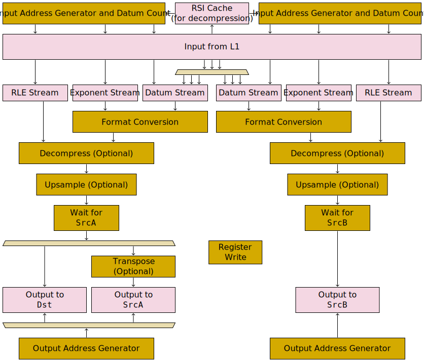

# Unpackers

There are two unpackers per Tensix Coprocessor. Unpacker 0 moves data from L1 to `Dst` or `SrcA`, meanwhile unpacker 1 moves data from L1 to `SrcB`. The two unpackers are mostly separate, though they have a few parts in common at the start of their pipeline. The combined pipeline diagram showing both is:

In its most basic configuration, with all optional features disabled, an unpacker just moves a contiguous range of datums from `L1` to a contiguous range of `Dst` or `SrcA` or `SrcB`. Various optional features can then be added on:
* [Format conversions](FormatConversion.md), which notably includes converting BFP data to FP16 or BF16.
* [Decompression](#decompression), to allow data containing lots of zeroes to take up less space in L1 (though attempting to compress data which _doesn't_ contain lots of zeroes will instead cause it to take up _more_ space in L1).
* [Upsampling](#upsampling), to either insert a fixed number of zeroes after each datum, or skip a fixed number of output positions after each datum.
* Only when writing to `SrcA`: X/Y transposition.

## Instructions

The primary instruction for using an unpacker is:
* [`UNPACR` (Move datums from L1 to `SrcA` or `SrcB` or `Dst`)](../UNPACR_Regular.md)

Several secondary instructions also exist:
* [`UNPACR` (Increment context counter)](../UNPACR_IncrementContextCounter.md)
* [`UNPACR` (Flush unpacker decompression row start cache)](../UNPACR_FlushCache.md)
* [`UNPACR_NOP` (Set `SrcA` or `SrcB` to zero, sequenced with UNPACR)](../UNPACR_NOP_ZEROSRC.md)
* [`UNPACR_NOP` (Give `SrcA` or `SrcB` banks to Matrix Unit, sequenced with UNPACR)](../UNPACR_NOP_SETDVALID.md)
* [`UNPACR_NOP` (MMIO register write sequenced with UNPACR)](../UNPACR_NOP_SETREG.md)
* [`UNPACR_NOP` (MMIO register write to Overlay `STREAM_MSG_DATA_CLEAR_REG_INDEX`, sequenced with UNPACR)](../UNPACR_NOP_OverlayClear.md)
* [`UNPACR_NOP` (Occupy Unpacker for one cycle)](../UNPACR_NOP_Nop.md)

## Decompression

If decompression is enabled, every datum is augmented with a four-bit counter specifying how many zeroes appear _after_ that datum.

See [packer compression](../Packers/Compression.md#in-memory--on-disk-format) for a description of the in-memory / on-disk format. Unpackers can consume this compressed format, perform decompression, and emit decompressed data to `Dst` / `SrcA` / `SrcB`.

To perform decompression during unpacking, one of either `ConfigState.THCON_SEC[WhichUnpacker].Disable_zero_compress_cntx[WhichContext]` or  `ConfigDescriptor.IsUncompressed` needs to be set to `false` (which one depends on the value of `MultiContextMode`; see the [`UNPACR` functional model](../UNPACR_Regular.md#functional-model) for details).

If decompressing, then an unpacker will consume both a datum stream and an RLE stream: the RLE stream specifies how many zeros to insert after every datum (which can be between 0 and 15). It expects these two streams to be interleaved in L1: 32 datums, then 32 RLE values, then 32 datums, then 32 RLE values, and so forth.

If decompressing, then the input address generator is also modified: it will consume either one or two row start indices from the `RSI` array produced by the packer. To aid sequential unpack instructions which consume adjacent compressed data, unpackers maintain a little cache of RSI data.

## Upsampling

Upsampling functionality can be used to either insert a fixed number of zeroes after each datum, or skip a fixed number of output positions after each datum. As per the [`UNPACR` functional model](../UNPACR_Regular.md#functional-model), it is configured via `Upsample_rate` and `Upsample_and_interleave`, with the possible behaviours being:

|`Upsample_rate`|`Upsample_and_interleave`|Behaviour|
|---|---|---|
|`0`|Any|No upsampling|
|`1`|`false`|Insert one zero datum after every datum|
|`2`|`false`|Insert two zero datums after every datum|
|`3`|`false`|Insert four zero datums after every datum|
|`1`|`true`|Skip one output position after every datum|
|`2`|`true`|Skip two output positions after every datum|
|`3`|`true`|Skip four output positions after every datum|
