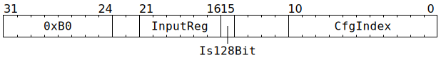

# `WRCFG` (Move from GPRs to thread-agnostic backend configuration)

**Summary:** Move either 32 or 128 bits from Tensix GPRs to thread-agnostic backend configuration. The current thread's `CFG_STATE_ID_StateID` determines which configuration bank is written to. This instruction cannot be used to write to `ThreadConfig` (see [`SETC16`](SETC16.md) for that).

**Backend execution unit:** [Configuration Unit](ConfigurationUnit.md)

## Syntax

```c
TT_WRCFG(/* u6 */ InputReg, /* bool */ Is128Bit, /* u11 */ CfgIndex)
```

## Encoding



## Functional model

```c
if (CfgIndex >= (CFG_STATE_SIZE*4)) UndefinedBehaviour(); // Cannot index out of bounds.

uint1_t StateID = ThreadConfig[CurrentThread].CFG_STATE_ID_StateID;

if (Is128Bit) {
  memcpy(&Config[StateID][CfgIndex & ~3], &GPRs[CurrentThread][InputReg & ~3], 16);
} else {
  Config[StateID][CfgIndex] = GPRs[CurrentThread][InputReg];
}
```

Note that `CfgIndex` values line up exactly with the `Name_ADDR32` constants in `cfg_defines.h`, though be aware that the `// Registers for THREAD` section of `cfg_defines.h` is for indexing in to `ThreadConfig` rather than `Config` (see [`SETC16`](SETC16.md) for that).

## Performance

This instruction requires two cycles to execute, but is fully pipelined, so a `WRCFG` instruction can be started every cycle. The issuing thread is not blocked, so it can potentially start its next instruction (of any kind) during `WRCFG`'s 2nd cycle.

## Instruction scheduling

Software must ensure that the instruction immediately after `WRCFG` is not trying to consume the configuration written by the `WRCFG` instruction. A NOP instruction can be inserted to ensure this (any kind of Tensix NOP suffices, though plain `NOP` is conventional).
