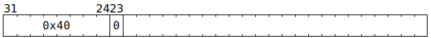

# `XMOV` (Instruct the mover)

**Summary:** Asynchronous bulk copy of data from L1 or from `/dev/null`, to L1 or to Tensix Backend Configuration or RISCV NC Instruction RAM, in aligned 16 byte units.

**Backend execution unit:** Mover

## Syntax

```c
TT_XMOV(0, 0)
```

## Encoding



## Functional model

```c
uint1_t StateID = ThreadConfig[CurrentThread].CFG_STATE_ID_StateID;
auto& ConfigState = Config[StateID];

Mover(ConfigState.THCON_SEC0_REG6_Destination_address,
      ConfigState.THCON_SEC0_REG6_Source_address,
      ConfigState.THCON_SEC0_REG6_Buffer_size,
      ConfigState.THCON_SEC0_REG6_Transfer_direction);
```

For the definition of the `Mover` function, see [the mover](../Mover.md). Note that RISCV cores can also use [TDMA-RISC](../TDMA-RISC.md) to instruct the mover.

## Instruction scheduling

The thread issuing an `XMOV` instruction will be automatically stalled until the mover is able to _start_ work, at which point `XMOV` will execute in a single cycle - the mover proceeds with the task in the background. [`STALLWAIT`](STALLWAIT.md) can be used with condition C12 to ensure that subsequent instructions do not start until the mover has finished the task.
