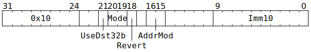

# `ZEROACC` (Mark some rows of `Dst` as undefined)

**Summary:** Mark either 1, 16, 256, 512, or 1024 rows of `Dst` as undefined. Subsequent operations which read from `Dst` then interpret undefined:
* Packers reading from `Dst` read undefined rows as zero.
* Matrix Unit (FPU) instructions read undefined rows as the identity element for the instruction being executed, which is negative infinity for `GMPOOL` / `MPOOL3S1` / `MPOOL3S2`, and is zero for all other instructions. In any event, the write performed by these instructions will then cause the row contents to become well defined.
* The Vector Unit (SFPU), exhibits undefined behaviour when reading (i.e. `SFPLOAD` / `SFPLOADMACRO`) an undefined row. It also exhibits undefined behaviour if `SFPSTORE` writes to _some_ columns of an undefined row but leaves other columns unwritten.
* Unpackers exhibit undefined behaviour if an unpack to `Dst` writes to _some_ columns of an undefined row but leaves other columns unwritten.

**Backend execution unit:** [Matrix Unit (FPU)](MatrixUnit.md)

## Syntax

```c
TT_ZEROACC(((/* bool */ UseDst32b) << 2) +
             /* u2 */ Mode,
             /* u2 */ AddrMod,
             /* u10 */ Imm10)
```

There is no syntax to specify `/* bool */ Revert`; if a non-zero value is desired for this field, the raw encoding must be used.

## Encoding



## Functional model

```c
if (Mode == ZEROACC_MODE_ONE_ROW) {
  uint1_t StateID = ThreadConfig[CurrentThread].CFG_STATE_ID_StateID;
  auto& ConfigState = Config[StateID];
  uint10_t Row = Imm10;
  Row += ThreadConfig[CurrentThread].DEST_TARGET_REG_CFG_MATH_Offset;
  Row += RWCs[CurrentThread].Dst + ConfigState.DEST_REGW_BASE_Base;
  if (ConfigState.ALU_ACC_CTRL_Fp32_enabled || ConfigState.ALU_ACC_CTRL_INT8_math_enabled) {
    Dst32b[Row][:] = Undefined;
  } else {
    Dst16b[Row][:] = Undefined;
  }
} else {
  if (Revert) {
    // If this branch is taken, then in the below, all assignments of Undefined
    // are instead un-assigning Undefined. Don't use this unless you really know
    // what you're doing.
    UndefinedBehaviour();
  }
  if (Mode == ZEROACC_MODE_16_ROWS) {
    Imm10 &= 0xff;
    if (UseDst32b) {
      if (Imm10 < 32) {
        for (unsigned i = 0; i < 16; ++i) Dst32b[Imm10 * 16 + i][:] = Undefined;
      }
    } else {
      if (Imm10 < 64) {
        for (unsigned i = 0; i < 16; ++i) Dst16b[Imm10 * 16 + i][:] = Undefined;
      }
    }
  } else if (Mode == ZEROACC_MODE_HALF_OF_DST) {
    if (Imm10 & 1) {
      // High half
      for (unsigned i = 512; i < 1024; ++i) Dst16b[i][:] = Undefined;
      for (unsigned i = 256; i <  512; ++i) Dst32b[i][:] = Undefined;
    } else {
      // Low half
      for (unsigned i = 0; i < 512; ++i) Dst16b[i][:] = Undefined;
      for (unsigned i = 0; i < 256; ++i) Dst32b[i][:] = Undefined;
    }
  } else /* Mode == ZEROACC_MODE_ALL_OF_DST */ {
    for (unsigned i = 0; i < 1024; ++i) Dst16b[i][:] = Undefined;
    for (unsigned i = 0; i <  512; ++i) Dst32b[i][:] = Undefined;
  }
}

if (Mode == ZEROACC_MODE_ONE_ROW || Mode == ZEROACC_MODE_16_ROWS) {
  ApplyAddrMod(AddrMod);
}
```

Supporting definitions:
```c
#define ZEROACC_MODE_ONE_ROW     0
#define ZEROACC_MODE_16_ROWS     1
#define ZEROACC_MODE_HALF_OF_DST 2
#define ZEROACC_MODE_ALL_OF_DST  3
```
