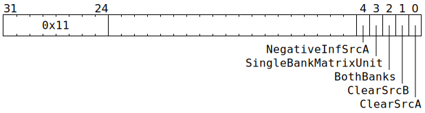

# `ZEROSRC` (Set `SrcA` and/or `SrcB` to zero)

**Summary:** Set either all or half of `SrcA` or `SrcB` (or both) to `0` or floating-point negative infinity (`SrcA` only).

**Backend execution unit:** [Matrix Unit (FPU)](MatrixUnit.md)

## Syntax

```c
TT_ZEROSRC(/* bool */ NegativeInfSrcA,
           /* bool */ SingleBankMatrixUnit,
           /* bool */ BothBanks,
         ((/* bool */ ClearSrcB) << 1) +
           /* bool */ ClearSrcA)
```

## Encoding



## Functional model

```c
// Determine what to clear.
bool ClearSrcABank[2] = {false, false};
bool ClearSrcBBank[2] = {false, false};
if (ClearSrcA) {
  if (BothBanks) {
    ClearSrcABank[0] = true;
    ClearSrcABank[1] = true;
  } else if (SingleBankMatrixUnit) {
    ClearSrcABank[MatrixUnit.SrcABank] = true;
  } else {
    ClearSrcABank[Unpackers[0].SrcBank] = true;
  }
}
if (ClearSrcB) {
  if (BothBanks) {
    ClearSrcBBank[0] = true;
    ClearSrcBBank[1] = true;
  } else if (SingleBankMatrixUnit) {
    ClearSrcBBank[MatrixUnit.SrcBBank] = true;
  } else {
    ClearSrcBBank[Unpackers[1].SrcBank] = true;
  }
}

// Do the clearing.
for (unsigned Bank = 0; Bank < 2; ++Bank) {
  for (unsigned i = 0; i < 64; ++i) {
    for (unsigned j = 0; j < 16; ++j) {
      if (ClearSrcABank[Bank]) SrcA[Bank][i][j] = NegativeInfSrcA ? ~0u : 0u;
      if (ClearSrcBBank[Bank]) SrcB[Bank][i][j] = 0u;
    }
  }
}
```

## Instruction scheduling

If clearing just a single bank, software may wish to use [`STALLWAIT`](STALLWAIT.md) (with block bit B6 and some of condition codes C8 through C11) prior to using `ZEROSRC`.
